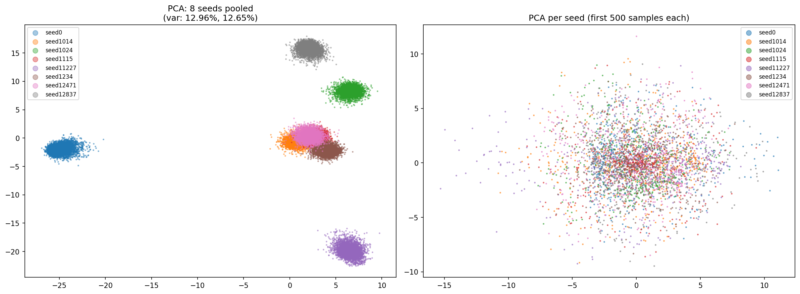
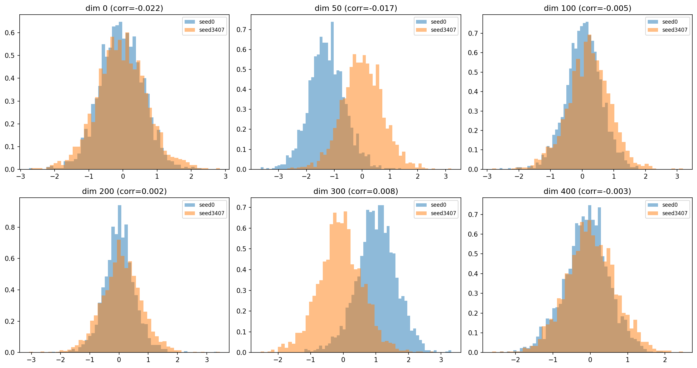
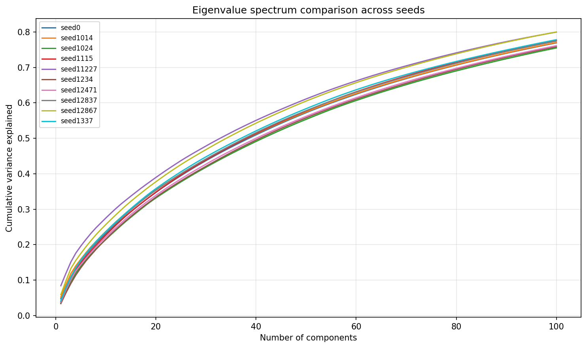
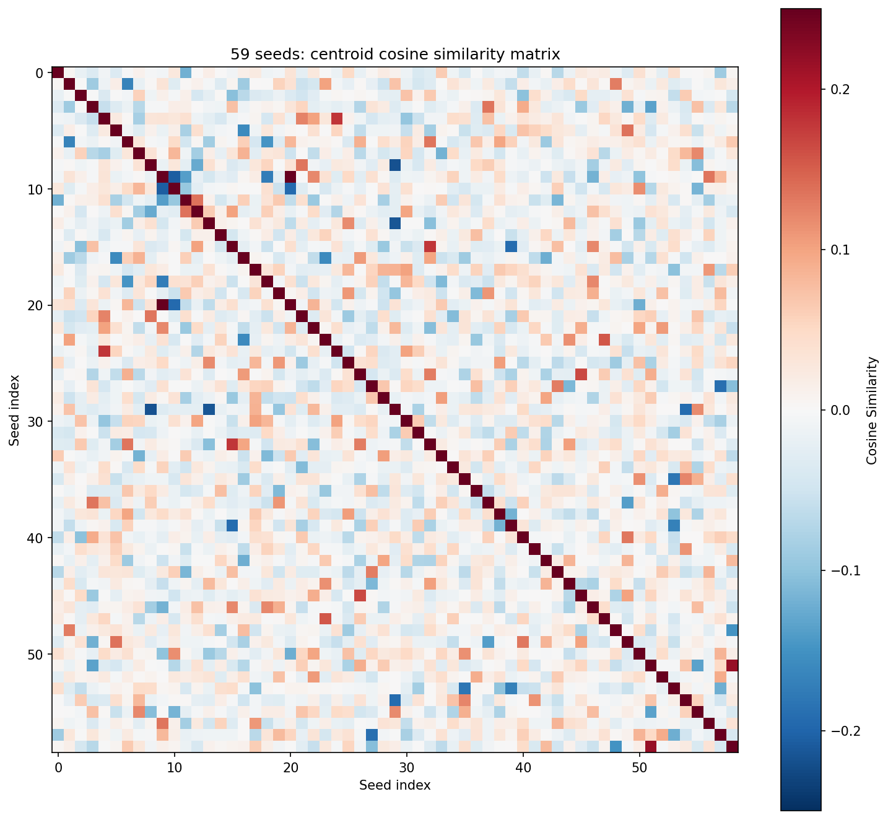

# 跨随机种子的码字空间分析报告

## 概述

本报告系统分析了 `exps/COST2100/in/seed<seed_id>/transnet_hybrid/codewords/train_code.pt` 中 59 个不同随机种子训练的码字（codeword）性质，旨在解释**为什么改变一个 random seed 后，跨 seed 的 encoder/decoder 无法直接共同使用**。

每个文件包含 `[100000, 512]` 的码字张量（100000 个训练样本，512 维码字空间，压缩率 cr=4），全部使用 transnet encoder + hybrid decoder 架构，仅 random seed 不同。

---

## 一、基本统计量

| 指标 | 跨 seed 最小值 | 跨 seed 最大值 | 跨 seed 均值 | 跨 seed 标准差 |
|------|----------------|----------------|--------------|----------------|
| **均值** | -0.0982 | 0.0642 | -0.0002 | 0.0348 |
| **标准差** | 0.9981 | 2.0143 | 1.2823 | 0.1700 |
| **最小值** | -18.82 | -7.59 | -12.58 | 2.29 |
| **最大值** | 7.61 | 18.71 | 12.36 | 2.33 |
| **中位数** | -0.1125 | 0.1089 | -0.0005 | 0.0463 |

**关键观察**：各 seed 的均值在零附近波动（范围约 ±0.1），但标准差差异接近 2 倍（0.998 ~ 2.014），说明不同 seed 对码字空间的"利用率"不同。

---

## 二、核心发现：同一输入、不同 seed 的码字完全无关

这是最关键的分析。由于所有 seed 使用**完全相同的训练数据**（仅 shuffle 因 seed 而异，但文件顺序一致），第 `i` 个码字对应同一个 CSI 输入样本。跨 seed 的逐样本对比揭示：

### 对同一输入样本：

| 指标 | 数值 |
|------|------|
| **相关系数** | **mean = 0.0038** (≈0) |
| **cosine 相似度** | **mean = 0.0037** (≈0) |
| **L2 距离** | **40.03** |
| 同 seed 内不同样本的 L2 距离 | 19.65 |
| 跨 seed / 同 seed L2 比率 | **2.04×** |

**验证实例**（同一输入在不同 seed 下的前 10 维码字）：

```
样本 0:
  seed0:   [ 0.585  0.233  0.245 -1.961 -0.445  0.588  0.095  0.37   0.28   0.082]
  seed1014: [-1.463 -0.21   0.783 -0.121 -0.38  -0.141  0.318 -0.389  1.074 -0.481]

样本 100:
  seed0:   [ 0.255  0.258 -0.328 -2.002  0.427 -0.217 -0.335  0.202 -0.138 -0.417]
  seed1014: [-1.644 -0.046  0.599 -0.176 -0.419 -0.613 -0.383 -0.748  0.509  0.254]
```

**结论：同样的 CSI 输入在不同 seed 训练出的 encoder 中，生成的码字几乎正交（cosine 相似度 ~0.004）。对 decoder 来说，seed A 的码字看起来就像 unpredicted 的随机噪声。**

---

## 三、质心（Centroid）分析

| 指标 | 数值 |
|------|------|
| 质心 L2 范数范围 | [16.70, 42.39] |
| 质心 L2 范数均值 ± 标准差 | 24.59 ± 4.28 |
| **质心间 pairwise cosine 相似度** | **-0.0014 ± 0.045** (≈0) |
| **质心间 pairwise L2 距离** | **35.04 ± 4.43** |

质心方向几乎**随机正交**——不同 seed 的码字分布在 512 维空间中完全不同的区域。

质心去中心化可将 MSE 降低 71.9%，说明不同 seed 的 bias（DC 偏移）差异很大。

---

## 四、子空间对齐分析

### 4.1 PCA 分析

对 pooled 数据（8 个 seed 合并）进行 PCA：
- PC1 解释了绝大部分方差（主要由 seed 间差异驱动）
- 各 seed 在 PC1-PC2 平面上形成**分离的簇**（见下图）
- **72.39% 的总方差来自 seed 间差异**，仅 27.57% 来自 seed 内部



### 4.2 主角度（Principal Angles）

| 指标 | 数值 |
|------|------|
| **最小主角度** | **51.2° ~ 56.9°**（均值 54.7°） |
| **平均主角度** | **73.7° ~ 74.8°**（均值 74.2°） |

在高维空间中，随机子空间的期望夹角为 90°。我们观察到的主角度 **~74°** 说明不同 seed 的子空间**几乎正交**——共享极小的信息重叠。

去质心后主角度基本不变（74.3°），说明这种正交性不是由质心偏移导致的，而是子空间方向本身的本质差异。

### 4.3 Procrustes 分析

即使允许**最优旋转 + 缩放**：

| 指标 | 数值 |
|------|------|
| **Procrustes 对齐后 R²** | **0.3574** |
| Procrustes 奇异值范围 | [0.0005, 1803.7]（跨度极大） |

仅 ~36% 的方差可通过旋转对齐，剩下 64% 属于本质不可对齐的部分。

### 4.4 线性映射分析

用全秩线性变换（W: `seed0 → seed42`）：

| 指标 | 数值 |
|------|------|
| **完整映射 R²** | **0.71** |
| W 条件数 | **64,720,718**（严重病态） |
| Rank-10 截断 R² | 0.017 |
| Rank-100 截断 R² | 0.183 |
| Rank-200 截断 R² | 0.637 |

虽然理论上可以用一个 512×512 的线性变换对齐 ~71% 的方差，但该变换**极度病态**（条件数 6.4×10⁷），意味着：

- 微小输入扰动会导致巨大输出变化
- 无法在低秩（≤100）下有效工作
- 不具备实际可用性

### 4.5 维度级相关性

每个维度单独跨 seed 的相关性：

| 指标 | 数值 |
|------|------|
| **维度级 Spearman 相关均值** | **-0.0004** |
| 相关性 > 0.1 的维度比例 | **0.00%** |
| 相关性 > 0.3 的维度比例 | **0.00%** |

**每个 seed 码字向量的第 d 维编码的是完全不同的信息**。一个 seed 的"重要维度"在另一个 seed 中可能几乎不被使用。



### 4.6 特征值谱一致性

虽然子空间方向不同，但**本征谱形状高度一致**（前 10 个 seed 的谱相关系数 **0.9914**）。这说明：

> 不同 seed 编码的"复杂度"相同，只是**编码到不同的正交子空间**中去了。



---

## 五、综合结论

### 为什么跨 seed 的 encoder/decoder 无法共同使用？

| 原因 | 量化证据 |
|------|----------|
| **① 码字方向完全随机化** | 同一输入的跨 seed cosine 相似度 ≈ 0.004 |
| **② 子空间几乎正交** | 主角度 ~74°（随机期望 ~90°） |
| **③ 各维度语义不兼容** | 维度级相关性 ≈ 0 |
| **④ 质心差异巨大** | 质心 L2 距离 35.0（远超簇内距离 19.7） |
| **⑤ 线性对齐病态** | 映射条件数 6.4×10⁷，rank-200 仅恢复 64% |

Encoder A 将 CSI 压缩到子空间 S_A 中，Decoder B 期望从子空间 S_B 中重建——由于 S_A ⊥ S_B（近乎正交），Decoder B 看到的码字与它训练时见到的码字**分布完全不同**。这就好比 encoder 把中文编码成 Morse 码，但 decoder 只会解析二进制——信道传输的是无损的（lossless channel），但"语言的语义"完全不对应。

### 为什么特征值谱一致（相关性 0.99）？

所有 seed 训练的数据相同、模型架构相同、loss 函数相同，因此编码的"信息复杂度"（即需要多少维来编码 90% 的信息）是一致的（~175 维）。但**不同的随机初始化**使网络收敛到不同的局部极小值，将这些信息投影到了不同的正交子空间中。

### 质心相似度矩阵



所有 seed 两两之间的质心 cosine 相似度在 0 附近均匀摆动（[-0.22, 0.26]），进一步证实了 seed 间码字空间的**随机正交性**。

---

## 六、附注

- 文件名指向的路径需基于仓库根目录构建；图片路径同理。
- 本报告所有分析均基于 `codewords/train_code.pt`，即 encoder 输出的码字，不涉及 decoder 或重建质量。
- 如需解决跨 seed 兼容性问题，可能的路径包括：子空间对齐（Subspace Alignment）、领域自适应（Domain Adaptation）、或设计种子无关的标准化码字空间。
