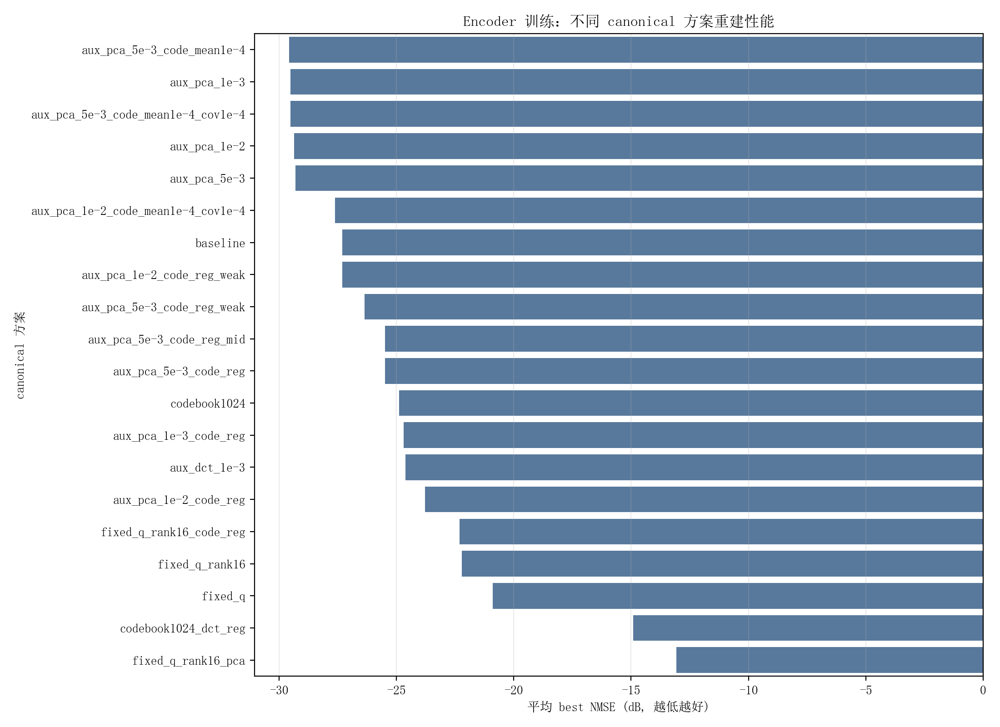
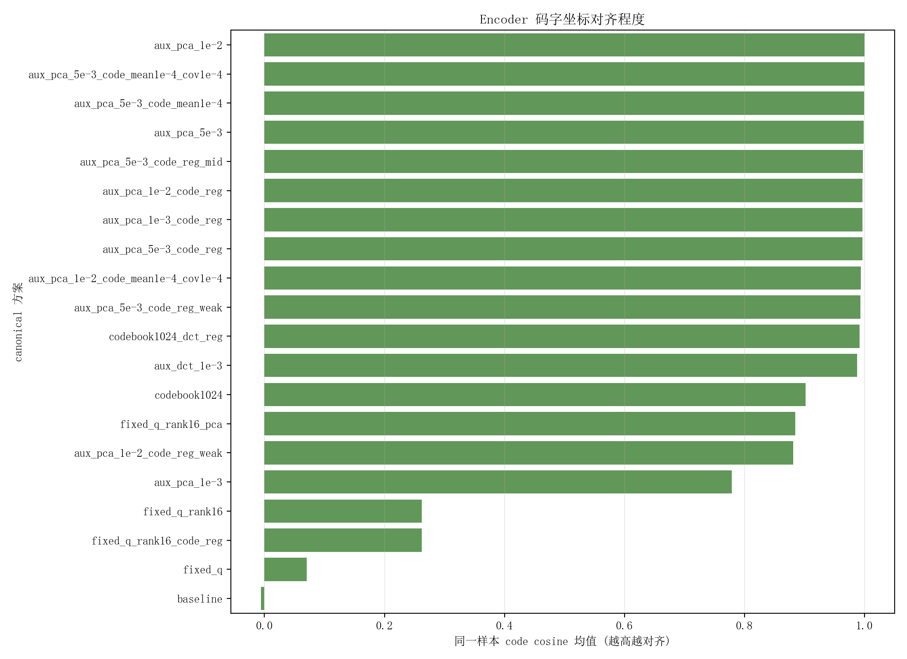
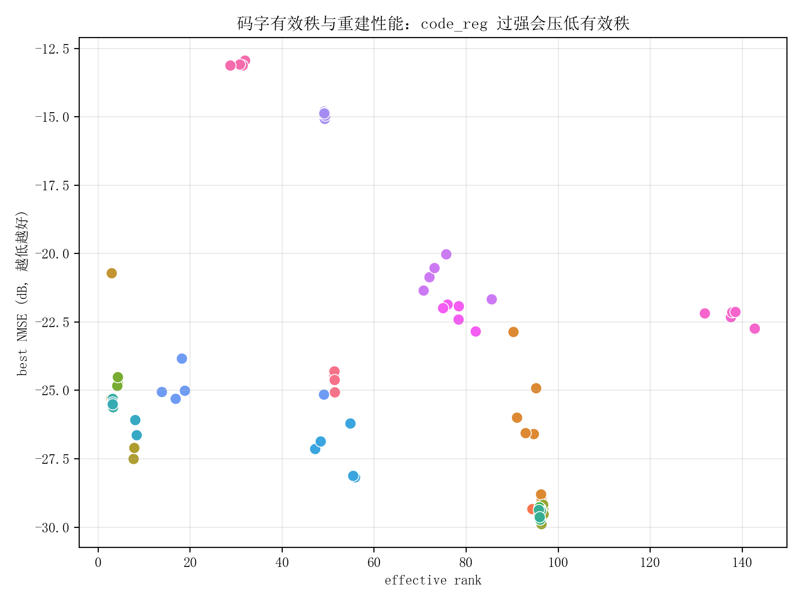
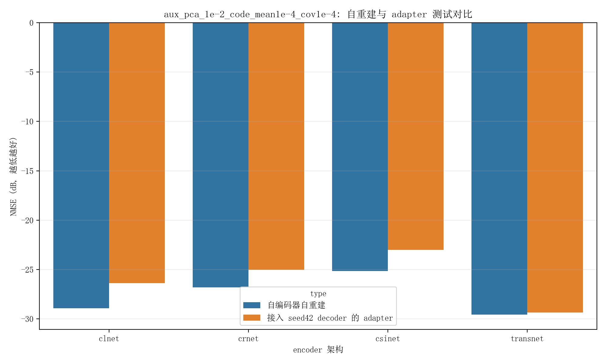
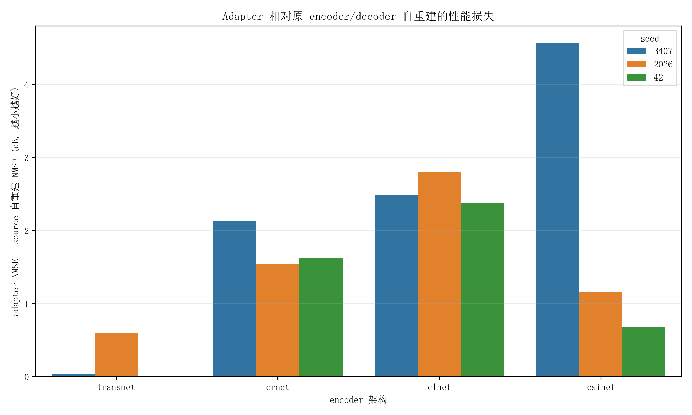
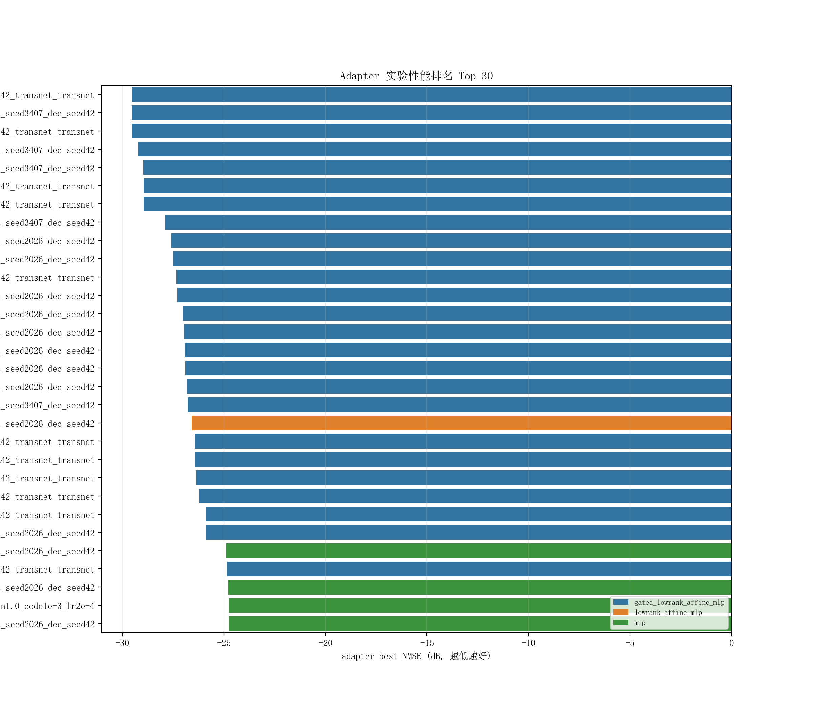
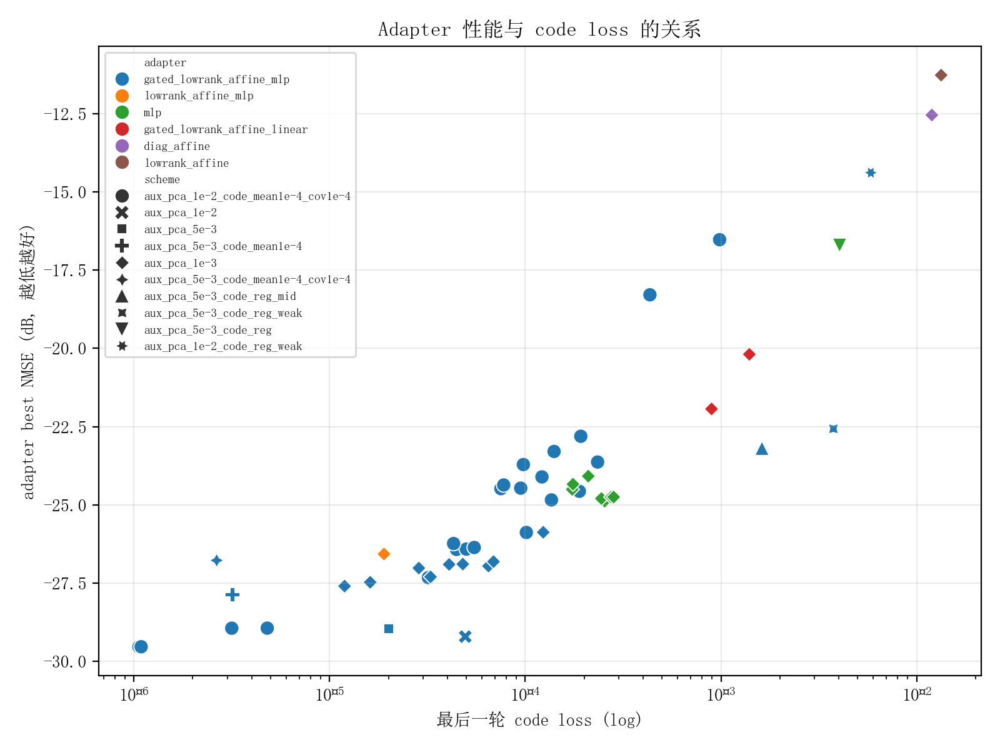

# encoder_canonical 全量实验分析报告

本文分析 `exps/COST2100/in/encoder_canonical` 下已经跑完的 canonical encoder、codeword 和 adapter 实验。分析脚本位于 `analysis/encoder_canonical/`，本次全量输出位于 `analysis_outputs/encoder_canonical_full/`。

本次重新生成了日志表、码字统计表、pairwise 码字对齐表和汇报图。码字统计使用全量 `train_code.pt`，每份 codeword 为 `100000 x 512`，分析命令为：

```bash
python analysis/encoder_canonical/run_all.py \
  --sample-size 1000000000 \
  --device cuda \
  --gpu 1 \
  --out-dir analysis_outputs/encoder_canonical_full

python analysis/encoder_canonical/deep_dive.py \
  --out-dir analysis_outputs/encoder_canonical_full

python analysis/encoder_canonical/final_report_plots.py \
  --out-dir analysis_outputs/encoder_canonical_full
```

## 一句话结论

`aux_pca` 公共 PCA anchor 是当前最有效的 encoder 坐标系约束，其中 `aux_pca_1e-2_code_mean1e-4_cov1e-4` 对同架构 transnet 的跨 seed 坐标对齐最稳定：transnet 三个 seed 的自重建 NMSE 为 `-29.579/-29.546/-29.571 dB`，跨 seed code cosine 均值达到 `0.999931`。这说明“固定公共锚点”确实能基本消除同架构不同 seed 的旋转自由度。

但这并不等价于 adapter 一定好用。adapter 最好结果来自同架构 transnet，`seed3407 encoder -> seed42 decoder` 可以达到 `-29.539 dB`，只比 source 自重建差 `0.032 dB`。跨架构时即使 code cosine 也很高，adapter 仍明显变差，说明问题已经从“随机 seed 旋转”转向“不同 encoder 架构学到的 code manifold 与 decoder42 的可解码流形不一致”。

## 0. 方法原理：这些实验到底在约束什么

这一节用于给没有接触过本问题的人讲清楚背景。CSI feedback 自编码器可以理解成：

```text
原始 CSI x -> encoder E(x) = code z -> decoder D(z) -> 重建 CSI x_hat
```

训练目标通常只有：

```text
D(E(x)) ≈ x
```

这个目标只要求“encoder 和 decoder 配合得好”，并不要求 `z` 的坐标系唯一。于是会出现一个自由度：如果 `R` 是可逆变换，那么：

```text
E'(x) = R E(x)
D'(z) = D(R^{-1} z)
```

理论上仍然可以重建得一样好。也就是说，不同 seed 训练出的模型可能都能重建，但它们的 code 坐标系彼此旋转、缩放或混合了。单独看 NMSE 看不出来这个问题，但把 seed A 的 encoder 接到 seed B 的 decoder 时就会崩。

### 0.1 baseline：没有公共坐标约束

baseline 就是普通自编码训练：

```text
loss = MSE(D(E(x)), x)
```

它的优点是自由度最大，模型可以自己找到最适合重建的 code 表达。缺点也正是自由度太大：每个 seed 都可以选择自己的 `R`，所以不同 seed 的 code 坐标不一致。

本次结果里 baseline 五个 seed 的 pairwise code cosine 均值是 `-0.0059`，接近随机正交。这说明 baseline 的不同 seed code 基本不在同一个坐标系里。

### 0.2 固定随机正交投影 Q：用固定坐标轴压住自由度

fixed Q 的想法是：不要让 encoder 最后一层自由地产生任意 code，而是让它经过一个所有 seed 共享的固定投影矩阵：

```text
feature h -> fixed Q -> code z
```

如果所有 seed 都用同一个 `Q`，那 code 至少有一个公共坐标轴参照。注意这个 `Q` 必须是全实验共享的固定文件或固定 buffer，不能每个 seed 各自随机生成，否则又回到不同坐标系。

它的核心问题是：随机 `Q` 不知道 CSI 数据的主变化方向。它虽然固定了坐标，但可能把重要信息投到不合适的方向，限制 encoder 表达能力。本次实验里 `fixed_q` 平均 NMSE 只有 `-20.888 dB`，明显差于 baseline 和 aux PCA，说明“坐标固定”本身不够，还要固定到一个对数据有意义的坐标系上。

### 0.3 固定 Q + 低秩残差：在固定坐标上留一点可学习自由度

`fixed_q_rank16` 的思路是在固定投影之外加一个低秩可学习修正：

```text
z = h Q^T + U(Vh)
```

其中 `U(Vh)` 是低秩残差，rank 很小。这样做的直觉是：主坐标由公共 Q 决定，模型只能在有限维度里修补随机 Q 的表达不足。

实验上它比纯 `fixed_q` 好一些，平均 NMSE 从 `-20.888 dB` 到 `-22.208 dB`，但仍然离 `aux_pca` 很远。这说明低秩残差能补一点表达力，但随机 basis 的根本问题没有解决。

### 0.4 固定随机 codebook：把 code 限制在公共码本的凸组合上

固定 codebook 的思路是：先固定一组公共 code 向量：

```text
C = {c_1, c_2, ..., c_K}
```

encoder 不直接输出任意 `z`，而是输出 assignment logits，再用 softmax 得到权重：

```text
w = softmax(logits)
z = sum_i w_i c_i
```

这样所有模型的 code 都落在同一个公共 codebook 张成的空间里。理论上这能减少坐标任意性。

但问题是：固定 codebook 的容量、分辨率和数据适配性都很关键。如果 codebook 是随机的，或者 K 不够大，encoder 只能在有限原型之间插值，重建精度会被限制。本次 `codebook1024` 的 pairwise cosine 有 `0.9017`，看起来比 baseline 对齐，但平均 NMSE 只有 `-24.874 dB`。这说明它确实让 code 更像，但表达能力不足。

`codebook1024_dct_reg` 更差，平均 NMSE 只有 `-14.910 dB`，说明当前 DCT 正则/codebook 组合和模型训练目标不匹配。

### 0.5 DCT/Fourier 物理 basis：用固定物理坐标当公共锚点

DCT/Fourier 的想法是利用信号本身的物理结构。CSI 在角延迟域往往有稀疏性或频域结构，所以可以用 DCT/Fourier basis 作为公共坐标：

```text
x -> DCT/Fourier coefficients -> target code
```

它的优点是：basis 不依赖某个 seed，也不依赖某个 encoder/decoder，是公共且可解释的。

缺点是：TransNet encoder 的中间 feature 不一定和原始 CSI 的 DCT/Fourier 系数同构。也就是说，DCT 是原始数据空间里的好 basis，不一定是神经网络 code 空间里的最佳 basis。本次 `aux_dct_1e-3` 的 code cosine 达到 `0.9877`，说明坐标对齐确实有效，但平均 NMSE 只有 `-24.612 dB`，重建明显不如 PCA anchor。

### 0.6 PCA anchor：用公共数据主成分当样本级锚点

PCA anchor 是当前最有效的方法。它先只基于公共原始训练数据计算 PCA basis，然后把每个样本投影到同一个 PCA 坐标系中，得到 auxiliary target：

```text
t(x) = PCA(x)
```

训练时除了重建 loss，还要求 encoder code 接近这个公共 target：

```text
loss = MSE(D(E(x)), x) + lambda_anchor * MSE(E(x), t(x))
```

它和固定随机 Q 的区别是：PCA basis 是从数据统计里来的，包含 CSI 数据最主要的变化方向；它和 codebook 的区别是：PCA 给每个样本一个连续 target，不是限制在有限原型的凸组合里。

它解决的是样本级坐标问题：同一个样本 `x` 在不同 seed 下都被拉向同一个 `t(x)`，因此不同 encoder 更难选择任意旋转 `R`。

实验上：

- `aux_pca_1e-3` 五个 transnet seed 平均 `-29.508 dB`，重建很强。
- `aux_pca_1e-2_code_mean1e-4_cov1e-4` 的 transnet 三 seed 平均 `-29.565 dB`，标准差仅 `0.017 dB`。
- transnet 跨 seed code cosine 达到 `0.999931`。

这说明 PCA anchor 同时兼顾了重建性能和坐标对齐。

### 0.7 mean/cov code regularization：约束分布形状，不约束样本坐标

code regularization 通常包括：

```text
mean(z) -> 0
cov(z) 的 offdiag -> 0
var(z_i) -> target variance
L1/L2 regularization
```

它的目标是让 code 分布更规整，比如均值接近 0、维度之间更独立、方差更均匀。

但它不能解决坐标唯一性。原因是：很多不同的正交旋转都可以保持均值、方差、协方差结构相近。也就是说，分布统计对齐不等于样本级坐标对齐。

更严重的是，当前强 code_reg 会损伤信息容量。本次实验里：

- 正常 aux PCA 的 effective rank 大约 `95~97`。
- `aux_pca_1e-3_code_reg` 的 effective rank 只有 `4.26`。
- `aux_pca_5e-3_code_reg` 的 effective rank 只有 `3.21`。
- `aux_pca_1e-2_code_reg` 的 effective rank 只有 `2.97`。

这说明强 code_reg 把 512 维 code 实际压成了几维，重建自然变差。因此 mean/cov 正则只能作为很弱的辅助，不能当主锚点。

### 0.8 adapter：不是重新训练 decoder，而是在两个 code 空间之间补映射

adapter 实验的目标是：保留目标 decoder，例如 `seed42_transnet_transnet` 的 decoder，然后把另一个 encoder 的 code 变换成这个 decoder 能解码的 code。

形式上：

```text
z_src = E_src(x)
z_adapt = A(z_src)
x_hat = D_42(z_adapt)
```

如果两个 encoder 只是差一个简单旋转或缩放，那么轻量 adapter 应该能学好。但如果两个 encoder 的 code manifold 不同，adapter 就不仅要做坐标变换，还要把样本推到 `D_42` 训练时见过的可解码流形上。

这解释了本次现象：

- transnet seed3407 到 seed42 decoder，adapter 只差 `0.032 dB`，说明同架构同 canonical 下主要是小坐标误差。
- clnet/crnet/csinet 到 seed42 transnet decoder 仍然掉 `1~4 dB`，说明跨架构已经不是简单坐标旋转，而是 decoder 兼容流形问题。

adapter loss 中的几项含义是：

```text
lambda_gt   * MSE(adapt_recon, gt)
lambda_code * MSE(z_adapter, z_teacher)
lambda_fc   * MSE(fc_adapter, fc_teacher)
lambda_recT * MSE(adapt_recon, teacher_recon)
```

- `lambda_gt`：直接让最终重建接近真实 CSI。
- `lambda_code`：让 adapter 后 code 接近 teacher code。
- `lambda_fc`：让 decoder 关键全连接层后的表示接近 teacher 表示。
- `lambda_recT`：让 adapter 输出的重建接近 teacher decoder 的重建。

实验相关性显示，`last_code_loss` 与 adapter NMSE 的相关系数是 `0.795`，`last_fc_loss` 是 `0.666`。这说明 adapter 失败时，主要症状就是 code/fc 表示仍贴不近目标 decoder 需要的分布。

## 实验覆盖与口径

日志汇总共 134 行：

| 类别                   | 数量 | 完成 final test | codeword |
| ---------------------- | ---: | --------------: | -------: |
| encoder/canonical 训练 |   80 |              80 |       80 |
| adapter 训练           |   54 |              47 |       54 |
| 总计                   |  134 |             127 |      134 |

有 7 个 adapter 没有 final test：6 个日志里有 `RuntimeError`，但已经训练到目标 epoch 并保存了 best/codeword；另一个 `aux_pca_1e-3` 的 3000 epoch adapter 停在 2793 epoch。本文所有性能比较统一优先使用 `best_nmse`，没有 best 时才回退到 `final_test_nmse`。

关键输出文件：

- `analysis_outputs/encoder_canonical_full/experiment_log_summary.csv`
- `analysis_outputs/encoder_canonical_full/codeword_stats.csv`
- `analysis_outputs/encoder_canonical_full/codeword_pairwise.csv`
- `analysis_outputs/encoder_canonical_full/deep_encoder_scheme_summary.csv`
- `analysis_outputs/encoder_canonical_full/deep_adapter_summary.csv`

## 1. Encoder 重建性能：PCA anchor 最有效，随机投影/codebook 不够



按 scheme 聚合的 encoder best NMSE 如下，NMSE 越低越好：

| scheme                               |  n | mean NMSE |     min |     max | 结论                          |
| ------------------------------------ | --: | --------: | ------: | ------: | ----------------------------- |
| `aux_pca_5e-3_code_mean1e-4`         |  2 |   -29.567 | -29.726 | -29.408 | 少量 seed，性能最好之一       |
| `aux_pca_1e-3`                       |  5 |   -29.508 | -29.889 | -29.181 | 五个 seed 全覆盖，性能强      |
| `aux_pca_5e-3_code_mean1e-4_cov1e-4` |  2 |   -29.503 | -29.635 | -29.371 | 性能强，但样本数少            |
| `aux_pca_1e-2`                       |  2 |   -29.355 | -29.370 | -29.339 | 性能稳定                      |
| `aux_pca_5e-3`                       |  2 |   -29.297 | -29.316 | -29.278 | 性能稳定                      |
| `aux_pca_1e-2_code_mean1e-4_cov1e-4` | 12 |   -27.607 | -29.579 | -22.864 | transnet 很强，跨架构拉低均值 |
| `baseline`                           |  5 |   -27.306 | -28.180 | -26.211 | 无公共锚点，seed 方差大       |
| `codebook1024`                       |  5 |   -24.874 | -25.308 | -23.838 | 固定 codebook 表达不足        |
| `fixed_q_rank16`                     |  5 |   -22.208 | -22.846 | -21.863 | 固定随机投影损失太大          |
| `fixed_q`                            |  5 |   -20.888 | -21.671 | -20.025 | 直接固定 Q 表达力不足         |
| `codebook1024_dct_reg`               |  5 |   -14.910 | -15.073 | -14.799 | DCT 正则过强/目标不匹配       |
| `fixed_q_rank16_pca`                 |  5 |   -13.073 | -13.123 | -12.944 | 当前实现下严重损伤重建        |

只看 `transnet_transnet`，`aux_pca_1e-2_code_mean1e-4_cov1e-4` 的三个 seed 平均 `-29.565 dB`，标准差只有 `0.017 dB`，比 baseline 的五 seed 平均 `-27.306 dB`、标准差 `0.845 dB` 明显更稳定。

这说明：

1. `aux_pca` 的公共数据 basis 是有效公共锚点。
2. `fixed_q` 虽然也固定了坐标，但它不是数据适配 basis，直接限制了 encoder 表达。
3. `codebook1024` 固定了码字集合，但表达分辨率和 assignment 学习不足，重建掉得明显。
4. DCT/fixed Q PCA 这类物理或随机 basis 当前不是最佳选择，至少需要重新检查 basis 和特征空间是否匹配。

## 2. 码字坐标对齐：baseline 几乎不对齐，PCA anchor 显著对齐



encoder-only pairwise code 对齐结果如下：

| scheme                               | pair 数 | code cosine 均值 | MSE 均值 | 解释                                  |
| ------------------------------------ | ------: | ---------------: | -------: | ------------------------------------- |
| `baseline`                           |      10 |          -0.0059 |   1.1193 | 不同 seed 的 code 坐标基本随机正交    |
| `fixed_q`                            |      10 |           0.0704 |   1.2165 | 固定 Q 没有让最终 code 对齐，且重建差 |
| `fixed_q_rank16`                     |      10 |           0.2623 |   0.3707 | 有改善但远不够                        |
| `codebook1024`                       |      10 |           0.9017 |  2.91e-5 | code 尺度极小，cosine 高但重建差      |
| `aux_pca_1e-3`                       |      10 |           0.7785 |   0.1370 | 比 baseline 好，但仍有 seed 差异      |
| `aux_dct_1e-3`                       |      10 |           0.9877 |   0.0567 | 坐标接近，但重建不够                  |
| `aux_pca_1e-2_code_mean1e-4_cov1e-4` |      66 |           0.9940 |   0.0574 | 全部 12 个 encoder 跨架构也较高       |
| `aux_pca_1e-2`                       |       1 |           0.9999 |   0.0021 | 两个 seed，几乎完全对齐               |
| `aux_pca_5e-3_code_mean1e-4_cov1e-4` |       1 |           0.9998 |  3.69e-4 | 两个 seed，几乎完全对齐               |

从数学上看，自编码器目标只约束：

```text
D_s(E_s(x)) ≈ x
```

如果存在可逆变换 `R`，那么：

```text
E'_s(x) = R E_s(x)
D'_s(z) = D_s(R^{-1} z)
```

可以得到近似相同的重建误差。这就是不同 seed 的 code 坐标系不唯一的根源。baseline 没有公共锚点，所以 pairwise cosine 接近 0；`aux_pca` 用同一个公共 PCA target 约束 encoder 输出，等价于给 `R` 的自由度施加了共同参照，因此 code cosine 明显上升。

## 3. code regularization 单独不够，过强会导致有效秩塌缩



encoder code 统计显示，`mean/cov` 这类正则本身不是公共锚点，它只能约束分布形状，不能唯一确定样本级坐标排列。更严重的是，当前若把 code regularization 权重设得偏强，会把 code 压到低有效秩。

| scheme                               | effective rank 均值 | cov offdiag ratio |           mean NMSE |
| ------------------------------------ | ------------------: | ----------------: | ------------------: |
| `aux_pca_1e-3`                       |               96.66 |            0.0769 |             -29.508 |
| `aux_pca_5e-3_code_mean1e-4`         |               96.17 |            0.0641 |             -29.567 |
| `aux_pca_5e-3_code_mean1e-4_cov1e-4` |               95.91 |            0.0503 |             -29.503 |
| `aux_pca_1e-2_code_mean1e-4_cov1e-4` |               94.77 |            0.1158 | -27.607，全架构均值 |
| `baseline`                           |               52.35 |            2.8201 |             -27.306 |
| `aux_pca_1e-3_code_reg`              |                4.26 |            9.5187 |             -24.698 |
| `aux_pca_5e-3_code_reg`              |                3.21 |           11.1065 |             -25.473 |
| `aux_pca_1e-2_code_reg`              |                2.97 |           11.5989 |             -23.773 |

结论很直接：当前 `code_reg` 方案不是在“规范坐标系”，而是在强行压低 code 自由度。effective rank 从约 95 降到 3 到 8，重建 NMSE 同时恶化到 `-23~-25 dB`。这解释了为什么带强 code_reg 的 adapter 也很差：adapter 接到的是信息已经受损的低秩 code。

因此后续不建议继续把 `code_reg` 当成主要 canonical 手段。它可以作为很弱的辅助项，例如只做均值约束或极弱 covariance 约束，但必须以 PCA/DCT/物理 basis 这类公共样本级 anchor 为主。

## 4. `aux_pca_1e-2_code_mean1e-4_cov1e-4`：同架构 seed 问题基本解决，跨架构仍未解决

这是当前最值得重点汇报的方案，因为它同时跑了 3 个 seed 和 4 个 encoder 架构。

### 4.1 自重建结果

| encoder  |  seed42 | seed2026 | seed3407 |
| -------- | ------: | -------: | -------: |
| transnet | -29.579 |  -29.546 |  -29.571 |
| clnet    | -28.803 |  -29.049 |  -28.919 |
| crnet    | -24.922 |  -28.874 |  -26.597 |
| csinet   | -26.562 |  -25.998 |  -22.864 |

transnet 和 clnet 都能到接近 `-29 dB`，但 crnet/csinet seed 方差较大。这个现象说明同一 canonical 约束对不同 encoder 架构并不等价：架构本身的归纳偏置会影响它能不能利用 PCA anchor。

### 4.2 code 统计

| encoder  | effective rank | cov offdiag ratio |    RMS |
| -------- | -------------: | ----------------: | -----: |
| transnet |          95.90 |            0.0491 | 0.2584 |
| clnet    |          96.32 |            0.0839 | 0.4628 |
| crnet    |          95.42 |            0.1385 | 0.2739 |
| csinet   |          91.43 |            0.1915 | 0.2074 |

transnet 的 offdiag 最低，说明它最接近目标去相关结构；csinet 的 rank 略低且 offdiag 更高，对应它的自重建和 adapter 表现也最不稳定。

### 4.3 pairwise 对齐

| pair 类型         | pair 数 | cosine 均值 | MSE 均值 | L2 均值 |
| ----------------- | ------: | ----------: | -------: | ------: |
| same encoder      |      12 |      0.9951 |   0.0496 |   3.007 |
| cross encoder     |      54 |      0.9938 |   0.0592 |   4.788 |
| transnet-transnet |       3 |    0.999931 |   4.3e-5 |   0.128 |
| clnet-transnet    |       9 |    0.998986 |   0.0427 |   4.536 |
| crnet-transnet    |       9 |    0.996376 |   0.0113 |   2.094 |
| csinet-transnet   |       9 |    0.990594 |   0.0586 |   5.306 |

这里有一个重要细节：cosine 高不代表 decoder 一定能接收。cosine 主要反映方向接近，但 decoder 对 code 的尺度、局部曲率、维度耦合和高阶结构也敏感。比如 clnet-transnet cosine 达到 `0.998986`，但 L2 仍有 `4.536`，adapter 接入 seed42 transnet decoder 后仍掉 2 dB 以上。

## 5. Adapter：同架构有效，跨架构仍是主要瓶颈





`aux_pca_1e-2_code_mean1e-4_cov1e-4` 下，固定 `seed42_transnet_transnet` 为 decoder，adapter 400 epoch 的结果如下：

| seed | encoder  | source 自重建 | adapter NMSE |   损失 |
| ---: | -------- | ------------: | -----------: | -----: |
| 3407 | transnet |       -29.571 |      -29.539 | +0.032 |
| 2026 | transnet |       -29.546 |      -28.947 | +0.599 |
| 2026 | crnet    |       -28.874 |      -27.329 | +1.545 |
|   42 | crnet    |       -24.922 |      -23.294 | +1.628 |
| 3407 | crnet    |       -26.597 |      -24.468 | +2.129 |
|   42 | clnet    |       -28.803 |      -26.418 | +2.385 |
| 3407 | clnet    |       -28.919 |      -26.427 | +2.492 |
| 2026 | clnet    |       -29.049 |      -26.239 | +2.810 |
|   42 | csinet   |       -26.562 |      -25.885 | +0.677 |
| 2026 | csinet   |       -25.998 |      -24.845 | +1.153 |
| 3407 | csinet   |       -22.864 |      -18.285 | +4.579 |

可以得出两个结论：

1. 同架构 transnet 的 adapter 是可行的。`seed3407 -> seed42` 几乎无损，说明 canonical 约束确实把两个 transnet encoder 的 code 拉到了 seed42 decoder 可接受的坐标附近。
2. 跨架构 adapter 仍然不稳。clnet 自重建能到 `-29 dB` 左右，但接入 seed42 transnet decoder 后只有 `-26.2~-26.4 dB`。这不是简单 seed 旋转问题，而是不同 encoder 架构学到的 code manifold 不完全落在 transnet decoder 的可解码流形上。

## 6. Adapter 结构对比：gated low-rank MLP 明显优于 MLP/linear/diag



adapter 汇总：

这里的“before adapter NMSE”来自每个 adapter 实验 `run.log` 里的 `before_train_test_nmse`，表示进入 adapter 训练流程前，当前 encoder 接到目标 decoder 后先评估一次得到的 NMSE。它不是 source encoder 搭配自己原 decoder 的自重建 NMSE；source 自重建只用于判断 adapter 相对原模型掉了多少。

| scheme / adapter                                                |  n | before adapter NMSE | adapter best NMSE | adapter mean NMSE | source 自重建 NMSE | adapter 相对 source 平均损失 | 结论                               |
| --------------------------------------------------------------- | --: | ------------------: | ----------------: | ----------------: | -----------------: | ---------------------------: | ---------------------------------- |
| `aux_pca_1e-2_code_mean1e-4_cov1e-4 / gated_lowrank_affine_mlp` | 23 |             -25.229 |           -29.540 |           -25.229 |            -27.521 |                        2.292 | 当前最好，跨架构方差大             |
| `aux_pca_1e-2 / gated_lowrank_affine_mlp`                       |  1 |             -29.216 |           -29.216 |           -29.216 |            -29.370 |                        0.154 | 同架构 transnet 可用               |
| `aux_pca_5e-3 / gated_lowrank_affine_mlp`                       |  1 |             -28.960 |           -28.960 |           -28.960 |            -29.316 |                        0.356 | 同架构 transnet 可用               |
| `aux_pca_5e-3_code_mean1e-4 / gated_lowrank_affine_mlp`         |  1 |             -27.876 |           -27.876 |           -27.876 |            -29.408 |                        1.532 | mean 约束后 adapter 损失变大       |
| `aux_pca_1e-3 / gated_lowrank_affine_mlp`                       |  9 |             -26.955 |           -27.601 |           -26.985 |            -29.620 |                        2.635 | 比 MLP 好，但仍比 source 差约 2 dB |
| `aux_pca_5e-3_code_mean1e-4_cov1e-4 / gated_lowrank_affine_mlp` |  1 |             -26.778 |           -26.778 |           -26.778 |            -29.371 |                        2.593 | code 更规整但 adapter 不一定更好   |
| `aux_pca_1e-3 / lowrank_affine_mlp`                             |  1 |             -26.490 |           -26.573 |           -26.573 |            -29.620 |                        3.047 | 加 MLP 后优于纯低秩线性            |
| `aux_pca_1e-3 / mlp`                                            |  9 |             -23.154 |           -24.884 |           -23.272 |            -29.620 |                        6.348 | 明显不够                           |
| `aux_pca_1e-3 / gated_lowrank_affine_linear`                    |  2 |             -21.039 |           -21.935 |           -21.061 |            -29.620 |                        8.559 | 线性替代 MLP 后效果差              |
| `aux_pca_1e-3 / diag_affine`                                    |  1 |             -11.771 |           -12.535 |           -12.535 |            -29.620 |                       17.085 | 只做逐维缩放/偏置不够              |
| `aux_pca_1e-3 / lowrank_affine`                                 |  1 |             -11.091 |           -11.259 |           -11.259 |            -29.620 |                       18.361 | 单纯低秩线性不够                   |

表中的“adapter 相对 source 平均损失”不是训练 loss，而是 `adapter mean NMSE - source 自重建 NMSE`，数值越小表示 adapter 接入目标 decoder 后越接近原本自重建性能。`before adapter NMSE` 和 `adapter mean NMSE` 在很多组里非常接近，说明这些 adapter 训练多数没有显著超过进入训练前的初始评估结果。

`GatedLowRankAffineLinearAdapter` 的两个实验分别只有 `-20.187/-21.935 dB`，说明用一个线性层替代 MLP 后表达力明显不足。这个结果支持之前的判断：adapter 不是简单尺度变换或低秩线性校准，它需要处理 decoder 可解码流形附近的非线性偏差。

## 7. Adapter loss 指标解释：code loss 和 fc loss 与坏结果高度相关



adapter 指标与 NMSE 的相关性如下。注意 NMSE 越低越好，所以正相关表示“该指标越大，结果越差”。

| 指标                           | 与 adapter NMSE 的相关系数 |
| ------------------------------ | -------------------------: |
| `adapter_vs_source_nmse_delta` |                      0.908 |
| `last_code_loss`               |                      0.795 |
| `last_fc_loss`                 |                      0.666 |
| `gate_mean`                    |                      0.548 |
| `lowrank_ratio`                |                      0.278 |
| `delta_ratio`                  |                      0.226 |
| `mlp_ratio`                    |                      0.118 |

这说明 adapter 失败时，最直接的症状不是参数量不够，而是 adapter 后 code 仍然无法贴近 teacher/source 所需的 code 或 fc 表示。`code_loss` 和 `fc_loss` 越大，NMSE 越差。

同时，`gate_mean` 较大也倾向于更差，说明当 adapter 被迫大幅改写 code 时，decoder42 通常并不能稳定解码。最好的 transnet seed3407 adapter 中 `delta_ratio=0.0074`、`gate_mean=0.0174`，几乎只做极小修正；而跨架构实验常见 `delta_ratio=0.4` 甚至 csinet 达到 `4~5`，这已经不是“坐标微调”，而是在硬把一个不同流形的 code 拉向 decoder42。

## 8. 为什么“码字已经约束了”adapter 还是不行

核心原因是：当前 canonical 约束主要解决一阶的公共坐标参照问题，但 decoder 兼容性要求更强。

PCA anchor 让不同 encoder 输出在公共 basis 上方向一致，这可以消除大部分旋转自由度：

```text
E_s(x) -> z_s,  z_s 接近公共 PCA 坐标
```

但 seed42 transnet decoder 实际学习的是：

```text
D_42: z_42 的训练分布/局部流形 -> CSI
```

跨架构 encoder 即使输出 `z_s` 与 `z_42` cosine 很高，也可能在以下方面不匹配：

- code 尺度不同；
- 各维高阶分布不同；
- 局部邻域结构不同；
- decoder 敏感方向上的误差较大；
- encoder 架构导致的信息压缩方式不同；
- adapter 训练被 `lambda_code/lambda_fc` 限制，不能自由移动到 decoder42 最舒服的区域。

因此，`aux_pca` 解决的是“公共坐标系”的必要条件，不是“任意 encoder 可无损接任意 decoder”的充分条件。

## 9. 对后续实验的建议

### 9.1 canonical 方案

优先保留：

- `aux_pca_1e-2_code_mean1e-4_cov1e-4`：同架构 transnet 最稳定，跨架构覆盖最多，最适合作为主线。
- `aux_pca_1e-3`：五 seed 全覆盖，重建最强之一，可作为性能上限参考。
- `aux_pca_5e-3_code_mean1e-4(_cov1e-4)`：少量 seed 表现很好，可以补 seed 验证。

不建议继续作为主线：

- `fixed_q` / `fixed_q_rank16`：确实固定坐标，但表达力损失太大。
- `codebook1024`：cosine 看起来高，但重建明显差，说明固定 codebook 不是当前瓶颈解。
- 强 `code_reg`：effective rank 塌缩到个位数，已经损伤信息容量。

### 9.2 adapter 方案

当前结果支持继续用 `gated_lowrank_affine_mlp`，不支持把 MLP 简化成单线性层。

后续优化方向：

1. 同架构 transnet adapter 可以继续做小修正路线。目标是保持 `delta_ratio < 0.05`、`gate_mean < 0.05`，避免 adapter 变成大幅重编码器。
2. 跨架构 adapter 应该单独设计，不要期待一个轻量 adapter 直接解决。可以尝试架构特定 adapter，或者先训练 `encoder -> seed42 decoder` 的 decoder-aware distillation。
3. 对跨架构实验，应降低 `lambda_code/lambda_fc` 的刚性，增加 `lambda_gt` 或 `lambda_recT` 的权重，让 adapter 有空间移动到 decoder42 可解码流形。
4. 监控 `last_code_loss`、`last_fc_loss`、`delta_ratio`、`gate_mean`。这些指标比单独看训练 loss 更能解释 adapter 是否真的兼容 decoder。
5. 不要再用强 code_reg 方案做 adapter 主实验，因为 source code 本身已经低秩受损。

## 10. 最终结论

从当前全量实验看，公共 PCA anchor 是正确方向。它不仅提高了自重建性能，还显著提高了不同 seed encoder 的 code 对齐程度。特别是 `aux_pca_1e-2_code_mean1e-4_cov1e-4`，在 transnet 同架构下已经基本把 code 编到同一个坐标系。

adapter 效果差的主要原因已经不是单纯坐标旋转，而是 decoder 兼容流形问题。对于同架构 transnet，adapter 可以做到几乎无损；对于 clnet/crnet/csinet，虽然 code 统计被规范化，decoder42 仍然无法直接把这些 code 当作自己的训练分布来解码。

因此后续主线应该是：

```text
公共 PCA anchor 继续保留
弱 mean/cov 正则作为辅助
避免强 code_reg
adapter 从“坐标校准”升级为“decoder-aware manifold adapter”
```

这条路线和实验数据是一致的：先用公共锚点消除 seed 旋转，再针对 decoder 兼容性专门优化 adapter。
