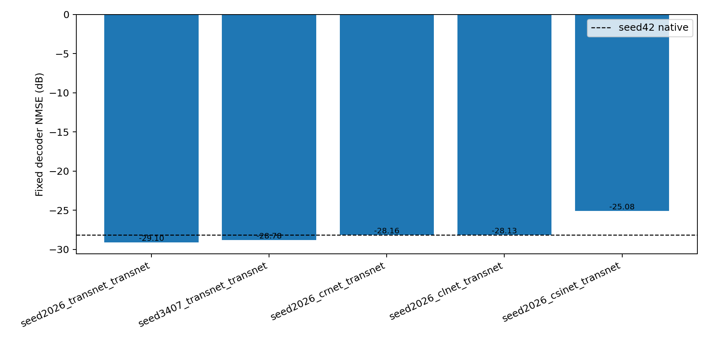
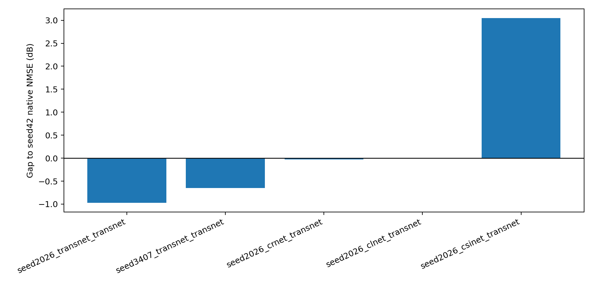
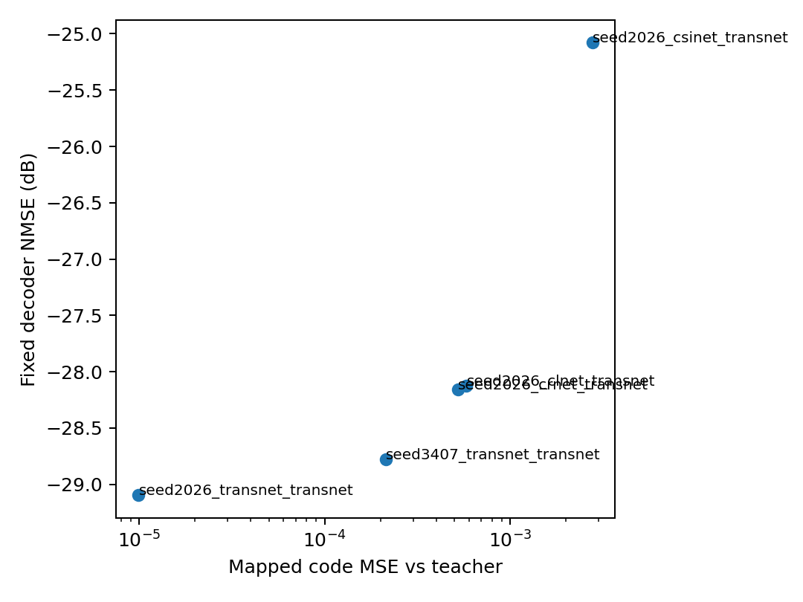
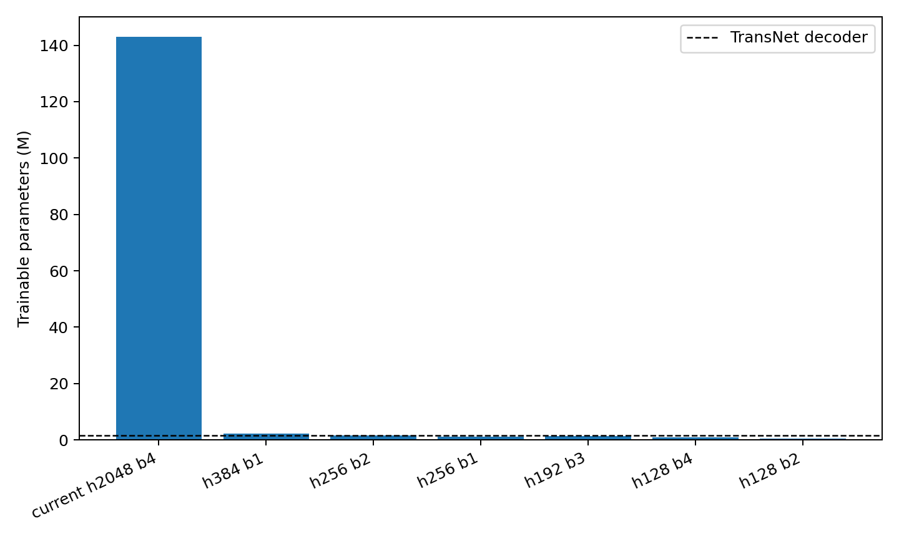

# Flow Matching Code-Only 实验分析

本报告分析 `flow_matching/exps/code_only` 下已经完成的 code-only flow matching 实验。所有 NMSE 结果均已重新用当前 `best_mse.pth` 导出 mapped code，并用固定的 `seed42/transnet_transnet` decoder 测试。

结果文件：

- 当前 NMSE 汇总：`flow_matching/reports/code_only_current_nmse.json`
- 图目录：`flow_matching/reports/code_only_analysis/figures/`

## 1. 实验设置

当前所有实验都使用同一个整体结构：

```text
source code z_s
  -> closed-form affine alignment: z0 = z_s W + b
  -> conditional flow matching velocity network
  -> 16-step Euler ODE
  -> mapped code
  -> fixed seed42 TransNet decoder
```

其中 `W,b` 是 `register_buffer` 保存的固定仿射闭式解，不是可训练参数；可训练部分只有 velocity network。

当前大模型配置：

```text
hidden_dim = 2048
num_blocks = 4
time_dim = 128
condition = source_start
trainable params = 142,938,624
alignment buffer = 512 * 512 + 512 = 262,656
TransNet decoder params ≈ 1,646,592
```

这意味着当前 flow matching 可训练参数约为 TransNet decoder 的 `86.8x`。

## 2. 当前 Best Model 的固定 Decoder NMSE

seed42 TransNet 原生 encoder+decoder NMSE：

```text
-28.126 dB
```

| source | scheduler | best epoch | best proxy | code MSE | code NMSE | fixed decoder NMSE | 相对 seed42 原生 | 相对 source 原生 |
| --- | --- | --- | --- | --- | --- | --- | --- | --- |
| seed2026_transnet_transnet | cosine | 395 | 4.423e-06 | 9.934e-06 | -48.10 | -29.10 | -0.97 | -0.92 |
| seed3407_transnet_transnet | const | 398 | 5.584e-05 | 2.138e-04 | -34.77 | -28.78 | -0.65 | -1.91 |
| seed2026_crnet_transnet | const | 399 | 1.031e-04 | 5.249e-04 | -30.87 | -28.16 | -0.03 | +1.56 |
| seed2026_clnet_transnet | const | 396 | 1.091e-04 | 5.820e-04 | -30.42 | -28.13 | -0.00 | +2.47 |
| seed2026_csinet_transnet | const | 391 | 2.812e-04 | 2.773e-03 | -23.64 | -25.08 | +3.05 | -0.32 |





## 3. 主要结论

1. **同架构 TransNet seed 间映射已经非常强。**

`seed2026_transnet_transnet -> seed42` 使用 warmup cosine 后，真实 mapped code MSE 到 `9.93e-6`，固定 decoder NMSE 达到 `-29.10 dB`，比 seed42 原生 `-28.13 dB` 还好约 `0.97 dB`。这说明同架构 seed 差异基本可以被 `affine + flow matching` 吃掉。

2. **CRNet/CLNet 跨架构映射已经接近 teacher decoder 原生水平。**

`seed2026_crnet_transnet -> seed42` 和 `seed2026_clnet_transnet -> seed42` 的固定 decoder NMSE 分别为 `-28.16 dB` 和 `-28.13 dB`，几乎贴近 seed42 原生 `-28.13 dB`。这比之前中途 checkpoint 的结果明显更好，说明训练跑满后跨架构也能显著提升。

3. **CSINet 仍然是主要短板。**

CSINet 最终 code MSE 为 `2.77e-3`，fixed decoder NMSE 为 `-25.08 dB`，相对 teacher 原生差约 `3.05 dB`。它的训练 proxy 已经降到 `2.81e-4`，但真实 ODE mapped code MSE 仍明显更高，说明 CSINet 的残差速度场更难学，且 ODE 积分误差/decoder 敏感方向误差更明显。

4. **code MSE 和 decoder NMSE 强相关，但不是线性等价。**



code MSE 从 `1e-5` 到 `5e-4` 时，decoder NMSE 都可以接近或超过 `-28 dB`；但 CSINet 的 `2.77e-3` 会明显掉到 `-25 dB`。如果目标是固定 decoder 原生 1 dB 内，当前经验阈值大约是：

```text
mapped code MSE <= 5e-4 到 7e-4
```

CSINet 仍需把 code MSE 从 `2.77e-3` 压低约 4-5 倍。

## 4. 训练日志与 Proxy Loss

| source | logged epochs | best endpoint epoch | best endpoint log | affine start MSE | max endpoint jump |
| --- | --- | --- | --- | --- | --- |
| seed2026_transnet_transnet | 400 | 395 | 4.423e-06 | 2.538e-02 | 1.04 |
| seed3407_transnet_transnet | 400 | 398 | 5.584e-05 | 3.487e-02 | 1.08 |
| seed2026_crnet_transnet | 400 | 399 | 1.031e-04 | 9.639e-02 | 1.21 |
| seed2026_clnet_transnet | 400 | 396 | 1.091e-04 | 9.856e-02 | 1.24 |
| seed2026_csinet_transnet | 400 | 391 | 2.812e-04 | 7.539e-02 | 1.12 |

需要注意：

- `best proxy/checkpoint_best` 是训练中的 endpoint proxy，不是最终 ODE mapped code MSE。
- 当前训练完成后，多数实验的 proxy 和真实 ODE code MSE 排序基本一致，但数值不相等。
- 之前恒定 lr 的 seed2026 TransNet 发生过中途崩溃；warmup cosine 版本稳定跑到后期，并取得当前最佳结果。

## 5. 为什么当前模型太大

当前 velocity network 的主要参数在 4 个 FFN block：

```text
hidden = 2048
每个 block 近似参数 = 8 * hidden^2 ≈ 33.6M
4 个 block ≈ 134M
总可训练参数 ≈ 142.9M
```

相比之下：

```text
TransNet decoder ≈ 1.65M
TransNet encoder ≈ 1.61M
整个 TransNet AE ≈ 3.26M
```

所以现在 mapper 比 decoder 大约 87 倍，工程上不合理，也不利于你后续“生成 mapper/flow 参数”。

## 6. 缩小参数量的优先方案

直接缩小 `hidden_dim` 和 `num_blocks` 的参数估算：

| 配置 | hidden | blocks | time_dim | 参数量 | 参数量(M) | 相对 decoder |
| --- | --- | --- | --- | --- | --- | --- |
| current h2048 b4 | 2048 | 4 | 128 | 142,938,624 | 142.939M | 86.81x |
| h384 b1 | 384 | 1 | 64 | 2,143,616 | 2.144M | 1.30x |
| h256 b2 | 256 | 2 | 64 | 1,660,416 | 1.660M | 1.01x |
| h256 b1 | 256 | 1 | 64 | 1,134,336 | 1.134M | 0.69x |
| h192 b3 | 192 | 3 | 64 | 1,332,800 | 1.333M | 0.81x |
| h128 b4 | 128 | 4 | 64 | 815,872 | 0.816M | 0.50x |
| h128 b2 | 128 | 2 | 64 | 551,936 | 0.552M | 0.34x |



建议按以下顺序试：

### 6.1 第一优先级：decoder 同量级小模型

```bash
hidden_dim=256 num_blocks=2 time_dim=64
hidden_dim=256 num_blocks=1 time_dim=64
hidden_dim=192 num_blocks=3 time_dim=64
```

这三组大概在 `0.6M-1.7M` 之间，和 decoder 同量级或更小。它们最适合验证“当前 142M 是否严重过参”。

### 6.2 第二优先级：保留 affine，学习低秩残差

当前 affine 已经提供了强起点：

```text
z0 = z_s W + b
```

flow matching 实际学习的是：

```text
delta = z_t - z0
```

因此可以把速度限制在低秩子空间：

```text
v_theta = U_r a_theta(x_t, t, z_s, z0)
U_r: fixed PCA basis, shape 512 x r
a_theta: small network output, shape r
```

推荐先试：

```text
rank = 64 或 128
hidden_dim = 256
num_blocks = 1 或 2
```

这比盲目加宽 hidden 更符合数学结构：全局线性坐标变换交给 affine，非线性残差只在低维子空间里修正。

### 6.3 第三优先级：one-step residual mapper

对于同架构 TransNet，当前 warmup cosine 已经把 code MSE 压到 `1e-5`。这说明路径很可能接近直线，不一定需要 16 步 ODE。可以测试：

```text
z_hat = z0 + g_theta(z_s, z0)
```

也就是 affine + 小 residual MLP。优点是参数少、推理只要一次前向；缺点是跨架构 CSINet 可能不够。

## 7. 推荐下一批实验

固定其他配置：

```text
align_mode=affine
condition=source_start
scheduler=cosine
lr=5e-4 或 1e-4
eta_min=5e-5 或 1e-5
ode_steps=16
```

建议先跑以下小模型：

```bash
hidden_dim=256 num_blocks=2 time_dim=64
hidden_dim=256 num_blocks=1 time_dim=64
hidden_dim=192 num_blocks=3 time_dim=64
hidden_dim=128 num_blocks=4 time_dim=64
```

评估标准：

```text
同架构 TransNet: fixed decoder NMSE >= -28 dB
CRNet/CLNet:     fixed decoder NMSE >= -27.5 dB
CSINet:          fixed decoder NMSE 是否能从 -25.1 dB 继续提升
```

如果小模型在 TransNet/CRNet/CLNet 上基本不掉，而 CSINet 掉得明显，则说明 CSINet 的难点不是参数量，而是跨架构 code 分布差异更强，需要 low-rank residual、tail loss 或 decoder-aware 第二阶段。

## 8. 总结

当前 `affine + flow matching` 的 code-only 方向是有效的：同架构 seed 间已经超过 teacher 原生 decoder 表现，CRNet/CLNet 跨架构也接近 teacher 原生水平。问题主要有两个：

1. 当前 velocity network 参数量过大，142.9M 明显超过任务需要。
2. CSINet 仍然难，说明跨架构分布差异不是单纯扩大模型就能优雅解决。

缩参上最务实的路线是：

```text
先把 hidden_dim 从 2048 降到 256/192，
把 num_blocks 从 4 降到 1-3，
保持 affine 起点和 warmup cosine，
用真实 ODE mapped code MSE / fixed decoder NMSE 选模型。
```

如果要进一步服务于“生成 flow-matching 参数”的长期目标，应优先发展：

```text
affine closed-form alignment + 小型 residual flow / low-rank residual mapper
```

而不是继续生成或训练 142M 参数的大网络。
