# 生成式码字映射与 Adapter 权重生成可行性调研报告

本报告回答两个问题：

1. 原始设想：把同一通信场景下的全量 CSI/codeword 集合作为条件，压缩成较小 set summary，再用生成式模型生成 adapter 参数，是否可行。
2. 新设想：不生成 adapter 参数，而是直接用生成式模型把一个 source code 转成固定 seed42 decoder 能识别的 teacher-style code，是否更可靠。

结论先说清楚：**直接生成/映射码字比生成 adapter 权重更可靠，也更符合当前项目的证据；但它本质上仍要把 `mapper(z_source) -> z_teacher` 的误差压到非常低，生成式模型不会自动绕过 fixed decoder 的敏感性。** 现有最好 mapped code 在 seed42 fixed decoder 下是 `-26.368 dB`，teacher code 是 `-29.103 dB`，仍差 `2.736 dB`。根据 teacher code 加噪声实验，要进入 `1 dB` gap，code MSE 至少应低于约 `7.54e-4`，而当前最好约 `2.09e-3`。

本次新增分析脚本：

```bash
python mapper/analyze_generative_code_mapping_feasibility.py --gpu 4 --pca_subset 20000
```

输出：

- `mapper/reports/generative_code_mapping_feasibility/local_summary.json`
- `mapper/reports/generative_code_mapping_feasibility/figures/*.png`

---

## 1. 问题建模

原始数据：

```text
X = {x_i}_{i=1..N},  x_i in R^{2 x 32 x 32},  N = 100000
```

`N` 是用户数/CSI 样本条数，不是时间序列长度。交换任意两行：

```text
(x_i, x_j) -> (x_j, x_i)
```

不应改变整个场景的统计含义。因此 `X` 和由 encoder 得到的码字：

```text
Z_s = {z^s_i}_{i=1..N},  z^s_i in R^512
```

都应该被看成 **set / empirical distribution**，而不是有顺序的 sequence。

固定 seed42 teacher：

```text
z^t_i = E_42(x_i)
D_t = seed42 transnet decoder
```

你的最终目标可以写成：

```text
给定 source encoder 产生的 z^s_i，
构造 z^a_i，使得 D_t(z^a_i) ≈ x_i，
最好 z^a_i ≈ z^t_i。
```

目前项目里 `mapper/` 做的就是确定性版本：

```text
z^a_i = M_theta(z^s_i)
loss = MSE(z^a_i, z^t_i) + 可选 decoder-aware loss
```

新问题是：是否把 `M_theta` 换成 diffusion / flow-matching 这样的生成式模型，直接生成 `z^a_i`，而不是先生成 adapter 权重再由 adapter 变换码字。

---

## 2. 当前项目证据

### 2.1 fixed decoder 真实 NMSE

固定：

```text
teacher code: exps/COST2100/in/seed42/transnet_transnet/codewords/train_code.pt
fixed decoder: exps/COST2100/in/seed42/transnet_transnet/checkpoints/best_nmse.pth
data: train, N=100000
```

关键结果：

| 输入 seed42 fixed decoder 的 code | code MSE to teacher | fixed decoder NMSE | gap to teacher |
|---|---:|---:|---:|
| teacher code | 0 | `-29.103 dB` | `0.000 dB` |
| old hybrid mapper, seed2026 transnet | `3.117e-3` | `-25.388 dB` | `3.716 dB` |
| smooth+tail+white hybrid mapper, seed2026 transnet | `2.093e-3` | `-26.368 dB` | `2.736 dB` |
| hybrid smoothl1, seed2026 clnet | `3.047e-3` | `-25.537 dB` | `3.567 dB` |
| old MLP mapper, seed2026 transnet | `3.92e-3` | `-24.765 dB` | `4.338 dB` |
| old flow mapper, seed2026 transnet | `6.86e-3` | `-23.190 dB` | `5.913 dB` |

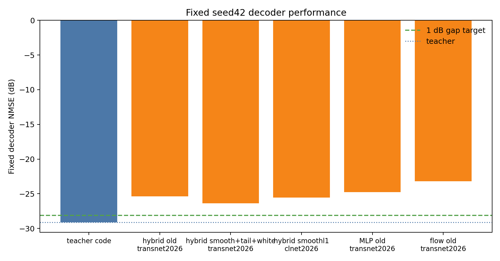

解释：

- mapper 路线是有效的：从 raw code cosine 接近 0，到 fixed decoder NMSE `-26 dB`，已经不是随机对齐。
- 但还没到可交付目标：离 teacher `-29.103 dB` 仍差 `2.736 dB`。
- 直接 code MSE 与 fixed decoder NMSE 强相关，但不是完全等价，因为 decoder 对不同 code 方向的敏感度不同。

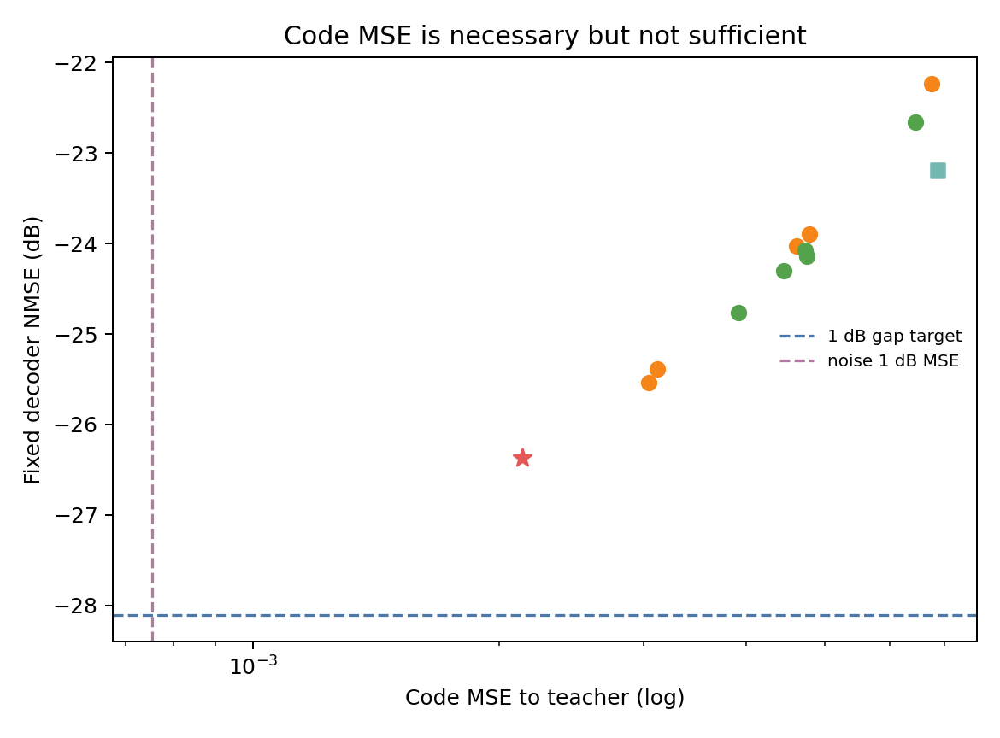

### 2.2 code MSE 门槛

已有 teacher code 加噪声实验：

```text
z_noisy = z_teacher + epsilon
epsilon 为 Gaussian 或 Laplace 独立噪声
```

fixed decoder NMSE 下降 `1 dB` 时：

```text
code MSE ≈ 7.54e-4
code RMSE ≈ 0.02746
```

当前最好 mapped code：

```text
code MSE = 2.093e-3
code RMSE = 0.04575
```

也就是当前最好 MSE 仍约为 `1 dB` 随机噪声阈值的：

```text
2.093e-3 / 7.54e-4 ≈ 2.78 倍
```

而且真实 mapper residual 不是独立同方差噪声，它有样本尾部、维度尾部和 decoder 敏感方向问题，所以实际目标应比 `7.54e-4` 更严格。我建议把第一阶段 code-only 目标定成：

```text
mean code MSE <= 5e-4
更稳妥：1e-4 ~ 3e-4
sample p95/p99 同时下降
dim RMSE max 同时下降
```

### 2.3 residual 尾部仍明显

当前最好 `smooth+tail+white` 确实降低了均值和样本尾部：

| 指标 | old hybrid | smooth+tail+white |
|---|---:|---:|
| mean code MSE | `3.117e-3` | `2.093e-3` |
| code RMSE | `0.05583` | `0.04575` |
| sample MSE p50 | `1.615e-3` | `1.733e-3` |
| sample MSE p95 | `1.079e-2` | `4.471e-3` |
| sample MSE p99 | `3.067e-2` | `7.449e-3` |
| dim RMSE mean | `0.05319` | `0.04002` |
| dim RMSE max | `0.32387` | `0.47047` |

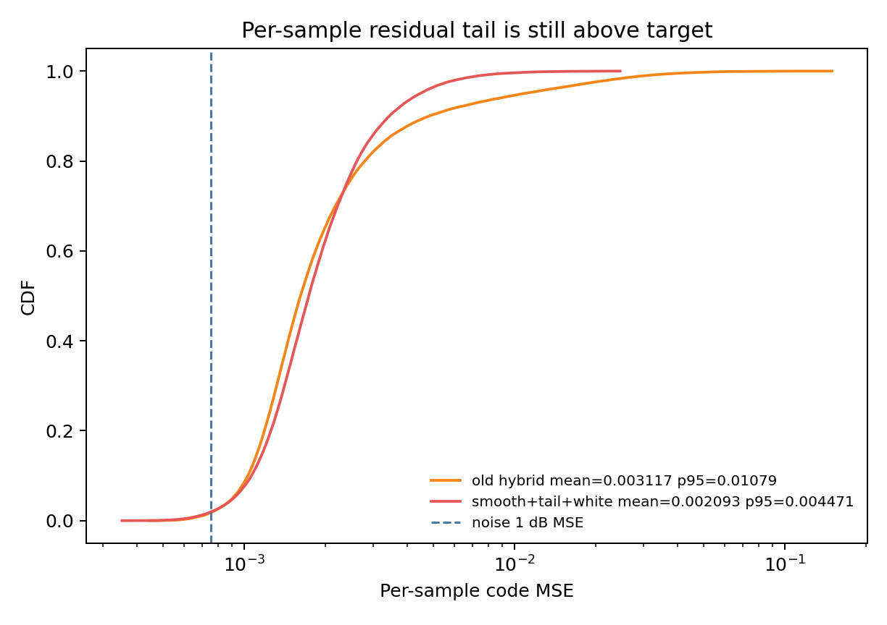

主要变化：

- `smooth+tail+white` 把样本尾部明显压下来了，p95 从 `1.079e-2` 到 `4.471e-3`。
- 但 sample p95 仍远高于 `7.54e-4` 阈值。
- dim RMSE max 反而更高，说明 tail/whiten loss 可能把误差从样本尾部转移到少数维度，后续需要维度级约束或 decoder-sensitive 约束。

残差分布仍是尖峰重尾：

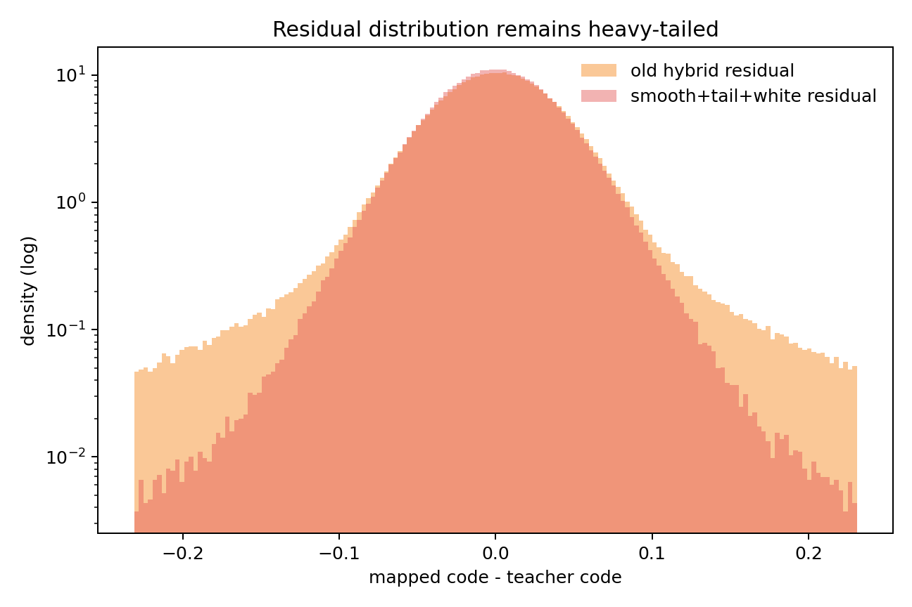

PCA 能量也说明 residual 不是极低秩误差：

| residual PCA | old hybrid | smooth+tail+white |
|---|---:|---:|
| top10 energy | `0.329` | `0.418` |
| top50 energy | `0.541` | `0.540` |
| top100 energy | `0.674` | `0.639` |

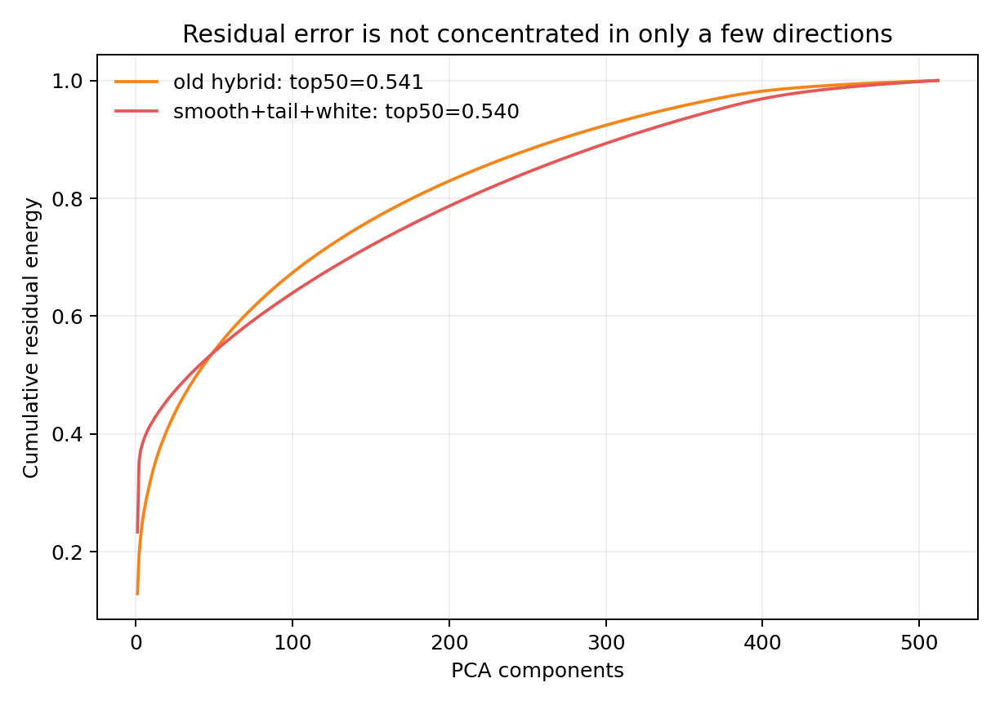

解释：

- top10 有一定主方向，说明残差有结构，不是纯白噪声。
- 但 top50 只有约 `54%` 能量，剩余误差仍分散在很多维度；单纯低秩线性修正不够。
- 这支持“粗全局映射 + 高容量非线性细修 + tail/decoder-sensitive loss”的结构，而不是只做低秩 affine。

### 2.4 fixed decoder 第一层本身会放大部分 code 方向

seed42 fixed decoder 的入口层：

```text
decoder.fc_decoder.weight: (2048, 512)
```

本次 GPU4 统计：

| 指标 | 数值 |
|---|---:|
| max singular value | `5.112` |
| p95 singular value | `1.744` |
| median singular value | `1.310` |
| mean singular value | `1.326` |
| min singular value | `0.779` |
| column norm mean | `1.365` |
| column norm max | `1.458` |

这说明即使只看 decoder 第一层，code 残差也不是等距传递：

```text
||fc(z_a) - fc(z_t)|| = ||W_fc (z_a - z_t)||
```

如果 residual 落在 `W_fc` 高奇异方向，重建会比普通 code MSE 预期更差。后续 Transformer decoder 还会继续放大或扭曲误差。因此：

```text
MSE(z_a, z_t)
```

只是必要条件，不是充分条件。更贴近任务的局部目标应是：

```text
||J_D(z_t)(z_a - z_t)||^2
```

其中 `J_D` 是 fixed decoder 对 code 的 Jacobian。

---

## 3. 原始方案：用码字集合生成 adapter 权重

### 3.1 方案形式

原始想法可写成：

```text
Z_s in R^{100000 x 512}
  -> set compressor / set encoder
  -> C in R^{K x d} 或 c in R^d
  -> generative model / hypernetwork
  -> adapter weights theta_A
  -> z_a = A_{theta_A}(z_s)
  -> D_t(z_a)
```

这里 `Z_s` 是一个 set，因此 compressor 必须满足 permutation invariance：

```text
summary({z_1, ..., z_N}) = summary({z_{pi(1)}, ..., z_{pi(N)}})
```

如果输出是 `K` 个 prototype/token，则 token 本身也应是 set-like 或有固定规范排序。

### 3.2 可用的 set 压缩方式

#### 3.2.1 随机采样 K 条 code

```text
C = {z_{i_1}, ..., z_{i_K}}
```

优点：

- 实现最简单。
- 保留真实样本，不会引入 PCA/聚类的线性假设。

问题：

- 方差大，K 小时容易漏掉尾部用户。
- 对 rare CSI 模式不稳定。
- 如果后续模型不是 set encoder，而是把 K 行当 sequence，仍会引入伪顺序。

改进：

- 按 code norm / reconstruction error / leverage score 分层采样。
- 多次采样做 ensemble summary。
- 用 deterministic coreset，而不是完全随机。

#### 3.2.2 SVD / PCA 压缩

对中心化 code 矩阵：

```text
Z_c = Z - mean(Z)
Z_c ≈ U_r Sigma_r V_r^T
```

可以保存：

```text
mean(Z), Sigma_r, V_r
```

其中 `V_r in R^{r x 512}` 描述 code 分布的主方向，`Sigma_r` 描述能量。

优点：

- 对行交换天然不敏感，因为协方差 `Z_c^T Z_c / N` 不依赖样本顺序。
- 计算上只需 `512 x 512` 协方差特征分解，不必对 `100000 x 512` 做 full SVD。
- 可解释，可直接看到 effective rank 和主方向。

问题：

- PCA 只保二阶统计，不能表达多峰分布和尾部。
- 特征向量有符号不唯一：`v` 和 `-v` 等价，需要固定符号规则，例如最大绝对值维度为正。
- 如果奇异值接近，子空间内部还存在旋转不唯一。

#### 3.2.3 K-means / prototype / coreset

```text
Z -> {prototype_k, weight_k}_{k=1..K}
```

优点：

- 比随机采样更稳定。
- 能保留多峰结构。
- weights 可表示不同用户簇占比。

问题：

- K-means prototype 顺序不唯一，需要按权重、norm 或某个投影排序。
- Euclidean K-means 不一定符合 decoder-sensitive 距离。
- rare but important tail 样本可能被小簇弱化。

#### 3.2.4 DeepSets

DeepSets 的典型形式：

```text
summary(Z) = rho( sum_i phi(z_i) )
```

它天然 permutation invariant，适合大 N。缺点是单纯 sum/mean pooling 对 pairwise 关系表达较弱。

#### 3.2.5 Set Transformer / inducing points

Set Transformer 用 attention 建模 set 元素关系，并用 PMA 或 inducing points 压缩到固定数量 token。

完整 self-attention 对 `N=100000` 不现实，复杂度近似 `O(N^2)`。本任务更适合：

```text
learned inducing tokens / latent tokens
cross-attention: K latents attend to N codes
latent self-attention
```

这类结构接近 Perceiver-style latent bottleneck。

#### 3.2.6 Neural Statistician / SetVAE 类 stochastic set latent

这类方法学习一个 dataset-level latent：

```text
q(c | {z_i})
p({z_i} | c)
```

优点是能表达 set 的不确定性和多模态；缺点是训练复杂，并且如果你只有一个通信场景，dataset-level latent 的监督样本数量很少。

#### 3.2.7 MMD / random projection / sliced-Wasserstein sketch

把 set 分布压成一组随机投影统计：

```text
mean_j exp(i omega_j^T z)
quantile(omega_j^T z)
histogram(omega_j^T z)
```

优点是 permutation invariant、可控制维度，适合做分布级 conditioner。缺点是它描述的是 source distribution，不直接告诉你 source-to-teacher 的样本级配对。

### 3.3 生成 adapter 权重的主要困难

#### 困难 A：一个场景不是多个任务

如果只有一个通信场景和一个目标 adapter：

```text
Z_1 -> theta_1
```

那训练生成式模型 `p(theta | summary(Z))` 的任务样本数本质是 1。把 `Z_1` 切成很多子集：

```text
Z_1^a, Z_1^b, ...
```

只能做数据增强，不能产生真正不同的 target adapter 分布。要训练可靠的条件权重生成器，需要多个 task：

```text
scene/source 1 -> theta_1
scene/source 2 -> theta_2
...
scene/source M -> theta_M
```

当前你有多个 seed/架构 source，但数量仍然很少。它们更适合作为评估集/少量任务，而不是训练一个大规模条件权重生成器。

#### 困难 B：权重空间有排列对称性

以 adapter 的 MLP 为例：

```text
h = GELU(W1 z + b1)
out = W2 h + b2
```

对 hidden neuron 做任意置换 `P`：

```text
W1' = P W1
b1' = P b1
W2' = W2 P^{-1}
```

函数不变，但参数完全不同。因此 raw weight MSE 会把两个等价 adapter 当成很远。

这就是 weight generation 的核心麻烦：**参数空间不是唯一坐标系，函数空间才是。**

#### 困难 C：低秩分解还有额外 gauge symmetry

如果 adapter 有低秩形式：

```text
Delta z = U V z
```

那么对任意可逆矩阵 `A`：

```text
U V = (U A^{-1})(A V)
```

函数等价，但参数不同。这会进一步恶化权重生成和权重 MSE 训练。

#### 困难 D：百万级权重生成样本效率低

当前 gated lowrank affine MLP adapter 参数主要集中在：

```text
mlp.0.weight: 2048 x 512
mlp.2.weight: 512 x 2048
```

参数量百万级。直接用 diffusion 在 raw weight 上生成，不仅训练贵，而且会被权重对称性干扰。更合理的做法是：

```text
adapter weights theta
  -> weight autoencoder / canonicalizer
  -> low-dimensional weight latent h_theta
  -> conditional generation p(h_theta | summary(Z))
  -> decode to theta
```

但这又要求你先收集很多 adapter 训练结果作为权重数据集。

### 3.4 对原始方案的判断

原始方案不是不能做，但它不是当前最优先路线。

更准确地说：

- 如果目标是做论文里“set-conditioned weight generation”，它有研究价值。
- 如果目标是尽快让不同 encoder 的 code 接上 fixed decoder，它绕远了。
- 在当前只有少量 seed/架构任务的情况下，训练 diffusion/flow 去生成 adapter 权重不可靠。
- 即使生成权重，也必须用 function-space loss 或 fixed decoder NMSE 来评价，不能只看权重 MSE。

---

## 4. 新方案：直接生成 fixed decoder 能识别的 code

### 4.1 数学形式

直接 code generation / code translation 可以写成：

```text
z^a_i = G_theta(z^s_i, c_s, eta)
```

其中：

- `z^s_i`：source encoder code。
- `c_s`：可选的 source set summary，例如 PCA/prototype/DeepSets summary。
- `eta`：生成式模型的噪声变量；若使用 deterministic ODE/mean prediction，可不采样随机噪声。
- `z^a_i`：目标是 seed42 decoder 能识别的 code，最好接近 `z^t_i`。

监督目标：

```text
L_code = MSE(z^a_i, z^t_i)
```

如果允许 decoder-aware：

```text
L = lambda_code * MSE(z^a, z^t)
  + lambda_fc   * MSE(fc_t(z^a), fc_t(z^t))
  + lambda_recT * MSE(D_t(z^a), D_t(z^t))
  + lambda_rec  * MSE(D_t(z^a), x)
```

### 4.2 这个方案比生成 adapter 权重更可靠

原因很直接：

| 维度 | 生成 adapter 权重 | 直接生成/映射 code |
|---|---|---|
| 输出空间 | 百万级参数 | 512 维 code |
| 对称性 | hidden permutation、低秩 gauge、符号/尺度等价 | teacher code 坐标固定，基本无权重对称性 |
| 训练样本 | 需要多个 task/adapter 权重 | 每个 CSI 样本都是一对 `(z_s, z_t)`，N=100000 |
| 评价目标 | 不能用 raw weight MSE | 可直接用 code MSE / fixed decoder NMSE |
| 与 fixed decoder 关系 | 间接，先生成函数参数 | 直接生成 decoder 输入 |
| 当前实验基础 | 尚未建立权重数据集 | 已有 mapper、codeword、NMSE、噪声阈值 |

因此，如果当前目标是“让 source encoder 的码字进入 seed42 fixed decoder”，直接 code translation 是更可靠的方向。

### 4.3 但它不是“省掉 adapter 训练”

需要强调：你不是省掉训练，而是把训练对象从：

```text
生成 adapter 参数 theta_A
```

换成：

```text
训练一个 code translator G_theta
```

当前 `mapper/` 里的 MLP/flow/hybrid 本质上已经是 code translator。区别只在于：

- 当前是确定性回归模型。
- 你提出的新方案可能用 diffusion / flow-matching 做条件生成。

如果每个 `z_s_i` 对应唯一 `z_t_i`，并且训练集就是全量 paired data，那么在 MSE 目标下，理论最优预测是：

```text
E[z_t | z_s]
```

也就是确定性条件均值。随机采样式 diffusion 可能反而引入额外噪声。生成式模型只有在以下情况更有价值：

1. `z_s -> z_t` 存在多解或强不确定性。
2. 你想显式匹配 teacher code 分布，而不仅是 pairwise MSE。
3. 你想做 iterative refinement，把重尾 residual 一步步修掉。
4. 你想训练一个跨 seed/跨架构的 universal translator，需要 `c_s` 表示 source encoder 的整体坐标系。

否则，强 deterministic residual mapper 可能比 diffusion 更稳、更快。

### 4.4 最关键的可识别性问题

如果训练时有 paired teacher code：

```text
(z^s_i, z^t_i)
```

那么目标坐标系由 `z^t_i` 明确给出，问题可识别。

如果没有 paired teacher code，只给 source code set：

```text
{z^s_i}
```

理论上无法唯一确定 teacher code 坐标。因为 source code 的边缘分布只描述 source encoder 自己的坐标系，不能告诉模型哪个方向对应 seed42 decoder 的哪个语义。即使两个分布都接近高斯，也可以存在很多保持分布的旋转：

```text
z -> R z
```

它们对 source distribution 等价，但对 fixed decoder 完全不同。

因此，直接 code generation 要可靠，至少需要一种锚点：

- 全量 paired `z_t`，即当前 mapper 设置。
- 少量 paired anchor，再用 set context 泛化。
- fixed decoder 的 reconstruction loss，`D_t(z_a) ≈ x`。
- teacher code 分布加 decoder-aware 约束。

只靠 source code marginal 训练一个 generator 去猜 fixed decoder 坐标，不可靠。

### 4.5 对新方案的总体判断

我对新方案的判断是：

```text
方向可靠，优先级高于 adapter 权重生成；
但不要一开始上随机采样 diffusion。
应先把它视为 supervised code translator，
先把 deterministic / rectified-flow residual mapper 做到 MSE <= 5e-4，
再考虑真正生成式建模。
```

---

## 5. 真正训练生成式模型前应该做什么分析

### 5.1 原始 CSI 数据分析

目标：判断 `X` 本身的内在维度、簇结构、尾部用户和物理稀疏性。因为 code translator 的难度很大程度取决于原始 CSI 分布是否低维、是否多峰、是否有异常样本。

本次已经直接对 train 全量 CSI 和码字做了补充分析：

```bash
python mapper/analyze_csi_code_deep_dive.py --gpu 4 --pca_samples 20000 --kmeans_k 8
```

输出目录：

```text
mapper/reports/generative_code_mapping_feasibility/csi_code_deep_dive/
```

其中 CSI 的基础统计和稀疏性使用全量 `N=100000`，PCA 和 k-means 使用均匀抽样 `20000` 条样本。

#### 5.1.0 本次原始 CSI 实测结论

原始 CSI 数据形状：

```text
X: (100000, 2, 32, 32)
```

基础能量统计：

| 指标 | 数值 |
|---|---:|
| global mean | `-3.39e-8` |
| global std / RMS | `0.02125` |
| sample power mean | `0.9245` |
| sample power p50 | `0.8425` |
| sample power p90 | `1.4610` |
| sample power p95 | `1.6968` |
| sample power p99 | `2.2035` |
| sample power max | `4.3439` |

real/imag 两个通道的 std 基本一致：

| channel | mean | std | abs mean |
|---:|---:|---:|---:|
| 0 | `6.11e-8` | `0.021254` | `0.004498` |
| 1 | `-1.29e-7` | `0.021240` | `0.004497` |

这说明当前预处理后的 COST2100/in train 数据整体已经中心化，两个通道尺度一致；后续 code 差异不是来自 real/imag 通道尺度偏置。

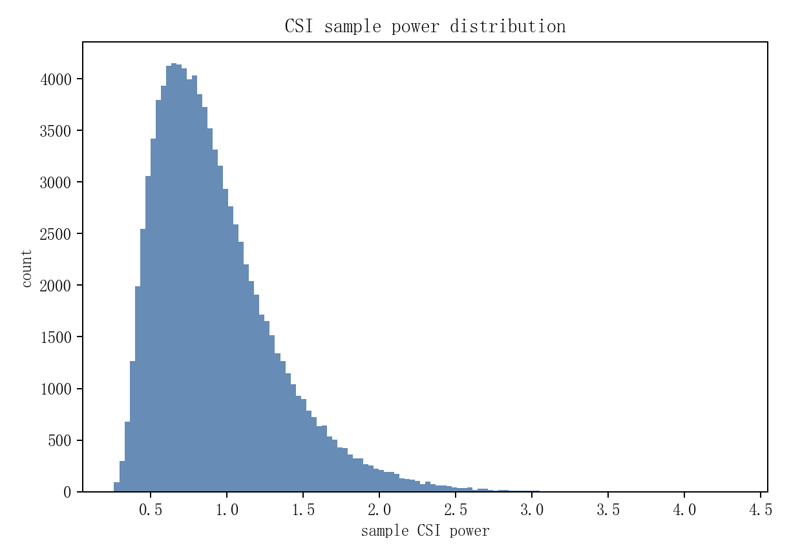

角延迟域能量非常集中：

| 稀疏性指标 | mean | p50 | p95 |
|---|---:|---:|---:|
| top 1% bins energy fraction | `0.8451` | `0.8524` | `0.9588` |
| top 5% bins energy fraction | `0.9689` | `0.9719` | `0.9965` |
| top 10% bins energy fraction | `0.9884` | `0.9897` | `0.9990` |
| bins for 90% energy | `18.90` | `17` | `38` |
| bins for 95% energy | `35.14` | `33` | `68` |
| bins for 99% energy | `104.76` | `105` | `180` |

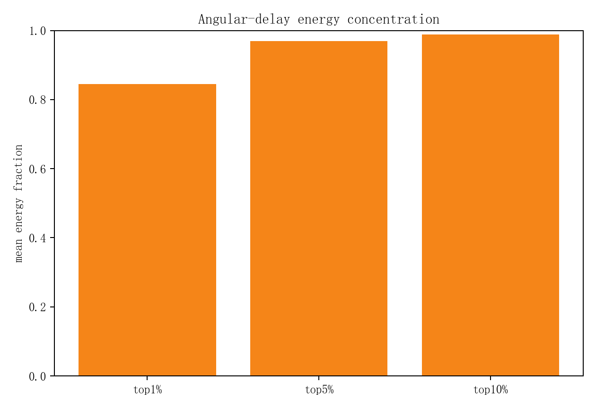

这对你的方案有两个含义：

1. 原始 CSI 本身有强物理稀疏结构，随机采样、prototype、PCA、DCT/Fourier 这类 set compression 有依据，不是盲目压缩。
2. 但稀疏性并不等于 code mapping 简单。top 5% bin 已经包含 `96.9%` 能量，但 baseline 不同 seed code 的 cosine 仍接近 0，说明神经网络 code 坐标自由度仍然存在。

原始 CSI PCA 结果：

| PCA 指标 | 数值 |
|---|---:|
| sample size | `20000` |
| input dim | `2048` |
| effective rank | `96.06` |
| top10 energy | `0.2203` |
| top32 energy | `0.4630` |
| top64 energy | `0.6663` |
| top128 energy | `0.8573` |
| top256 energy | `0.9565` |
| top512 energy | `0.9989` |
| rank for 90% energy | `162` |
| rank for 95% energy | `242` |
| rank for 99% energy | `374` |

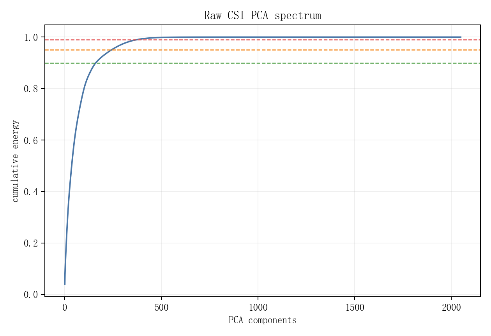

解释：

- 原始 CSI 不是几维就能表示的极低维数据，`95%` 能量需要约 `242` 个 PCA 分量。
- 但它也远低于满秩 `2048`，effective rank 约 `96`，说明存在明显公共低维结构。
- 这支持用 `PCA summary`、`prototype summary`、`Perceiver latent tokens` 来压缩整个 CSI/code set，但不支持只用很小的 K 或极低秩线性变换来完成全部对齐。

CSI PCA k-means 聚类结果显示，hardness 在簇间有差异但不是由单一簇支配：

| cluster | n | power mean | top5 energy frac | raw source MSE | old mapped MSE | new mapped MSE |
|---:|---:|---:|---:|---:|---:|---:|
| 3 | 2025 | `0.9731` | `0.9657` | `1.2668` | `3.203e-3` | `2.151e-3` |
| 2 | 1775 | `0.9396` | `0.9712` | `1.1916` | `2.971e-3` | `2.152e-3` |
| 0 | 8587 | `0.9052` | `0.9679` | `1.2267` | `3.209e-3` | `2.113e-3` |
| 6 | 1748 | `0.9218` | `0.9710` | `1.2049` | `2.807e-3` | `1.959e-3` |

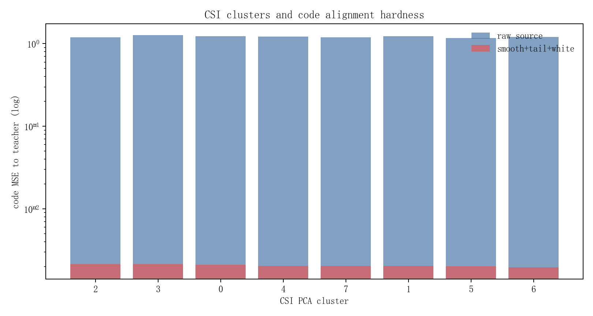

其中 `cluster 3` 的 power 最高、top5 energy fraction 最低，也是 raw source MSE 最高的簇之一；但 mapped MSE 的簇间差异已经明显缩小。这说明当前 mapper 已经学掉了很大一部分由 CSI 能量/稀疏性带来的系统性差异，剩下的问题更多是 code 坐标细节、尾部样本和 decoder 敏感方向。

更直接的相关性：

| code residual | corr with CSI power | corr with top5 energy fraction |
|---|---:|---:|
| raw seed2026 transnet -> teacher | `0.907` | `-0.729` |
| raw seed2026 clnet -> teacher | `0.949` | `-0.726` |
| raw seed2026 csinet -> teacher | `0.922` | `-0.671` |
| old hybrid mapped residual | `0.218` | `-0.201` |
| smooth+tail+white mapped residual | `0.493` | `-0.440` |

解释：

- raw source-to-teacher MSE 与 CSI power 强相关，高能样本天然 code 差异更大。
- raw source-to-teacher MSE 与 top5 energy fraction 负相关，越不稀疏、能量越分散的样本越难对齐。
- mapper 后相关性下降，说明 mapper 已经做了有效归一化和坐标迁移。
- 但 `smooth+tail+white` 的 residual 与 CSI power/top5 sparsity 仍有中等相关性，说明下一步可以考虑把 CSI power、source code norm、cluster/prototype context 加进 loss weighting 或 conditional mapper。

#### 5.1.1 基础能量统计

对每个样本：

```text
power_i = ||x_i||_2^2
```

分析：

- real/imag mean/std。
- per-channel power。
- sample power p50/p90/p95/p99。
- 是否有异常高能或低能样本。

用途：

- 判断 hard samples 是否只是高能样本。
- NMSE 分母是 signal power，低能样本可能对 NMSE 更敏感。

#### 5.1.2 角延迟域稀疏性

对每个 `2 x 32 x 32` CSI：

```text
energy map = real^2 + imag^2
```

分析：

- top 1%、5%、10% bin 占总能量比例。
- 达到 90%、95%、99% 能量需要多少 bin。
- delay profile / angle profile。
- 稀疏模式是否多峰。

用途：

- 如果原始 CSI 高度稀疏，PCA/DCT/prototype 压缩更可能有效。
- 如果稀疏模式跨用户变化很大，需要 set transformer/prototype 而不是单一全局 PCA。

#### 5.1.3 原始 CSI PCA / effective rank

展平：

```text
X_flat in R^{100000 x 2048}
```

计算：

```text
cov_X = X_c^T X_c / N
eig(cov_X)
```

输出：

- top-k cumulative energy。
- r90/r95/r99。
- effective rank。

用途：

- 如果 `r95` 很小，说明通信场景本身有低维结构，code set 压缩和 code generator 更容易。
- 如果 `r95` 很大，source-to-teacher 映射可能需要更多样本级非线性。

#### 5.1.4 CSI 聚类与 hard sample 关联

对 `X_flat` 或 PCA 后特征聚类：

```text
k-means / GMM / spectral clustering
```

再看：

- 每个簇的 teacher reconstruction NMSE。
- 每个簇的 mapper residual MSE。
- 每个簇的 fixed decoder NMSE gap。

用途：

- 找到 mapper 失败是不是集中在某些信道模式。
- 决定是否需要 cluster-conditioned mapper 或 mixture-of-experts。

### 5.2 码字分析

当前已有 `mapper/reports/codeword_analysis/` 和 `mapper/reports/mapper_distribution_analysis/`，建议后续固定输出以下指标。

#### 5.2.0 本次码字实测结论

本次码字分析使用全量 `N=100000`，目标 teacher 为：

```text
exps/COST2100/in/seed42/transnet_transnet/codewords/train_code.pt
```

输出文件：

```text
mapper/reports/generative_code_mapping_feasibility/csi_code_deep_dive/code_stats_full.csv
mapper/reports/generative_code_mapping_feasibility/csi_code_deep_dive/code_pair_stats_full.csv
mapper/reports/generative_code_mapping_feasibility/csi_code_deep_dive/code_linear_alignment.csv
```

单个 code 分布统计：

| code | std | norm mean | effective rank | top50 PCA energy | 解释 |
|---|---:|---:|---:|---:|---|
| teacher | `0.8007` | `17.885` | `55.46` | `0.6270` | seed42 fixed decoder 的目标 code 分布 |
| seed2026 transnet | `0.7612` | `16.977` | `55.86` | `0.6411` | rank 接近 teacher，但坐标不对齐 |
| seed3407 transnet | `0.7318` | `16.404` | `48.39` | `0.6610` | 同架构不同 seed，分布形状略不同 |
| seed2026 clnet | `0.5623` | `12.435` | `116.29` | `0.5500` | 跨架构，rank 更高、尺度更小 |
| seed2026 crnet | `0.4608` | `10.181` | `109.70` | `0.5567` | 跨架构，尺度更小 |
| seed2026 csinet | `1.1460` | `25.304` | `69.69` | `0.6257` | 跨架构，尺度最大 |
| old hybrid mapped | `0.7972` | `17.813` | `54.54` | `0.6299` | 分布已非常像 teacher |
| smooth+tail+white mapped | `0.7982` | `17.832` | `54.96` | `0.6287` | 分布也非常像 teacher |
| smoothl1 clnet mapped | `0.7992` | `17.855` | `55.42` | `0.6289` | 跨架构 mapped 后分布也像 teacher |

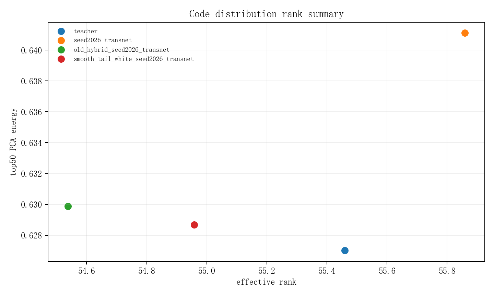

关键解释：

- baseline source code 与 teacher 的边缘分布可以很像，例如 `seed2026 transnet` effective rank 几乎等于 teacher，但样本级坐标仍完全不对齐。
- mapped code 的全局分布已经非常接近 teacher，包括 std、norm、effective rank、top50 PCA energy。
- 因此当前失败不是“mapped code 分布不像 teacher”，而是“每个样本的 mapped code 还没有精确落到对应 teacher code 上”，并且误差仍会被 fixed decoder 放大。

全量 source/mapped 到 teacher 的 pairwise 结果：

| code | MSE | cosine | sample p95 MSE | sample p99 MSE | dim RMSE max |
|---|---:|---:|---:|---:|---:|
| raw seed2026 transnet | `1.2166` | `0.0022` | `1.9996` | `2.4714` | `2.3612` |
| raw seed3407 transnet | `1.1806` | `-0.0023` | `1.8789` | `2.2872` | `2.0556` |
| raw seed2026 clnet | `0.9599` | `-0.0032` | `1.6295` | `2.0470` | `2.2827` |
| raw seed2026 crnet | `0.8519` | `0.0028` | `1.4393` | `1.8016` | `2.0671` |
| raw seed2026 csinet | `1.9664` | `-0.0055` | `3.5162` | `4.5647` | `3.1052` |
| old hybrid mapped | `3.117e-3` | `0.99767` | `1.079e-2` | `3.067e-2` | `0.3239` |
| smooth+tail+white mapped | `2.093e-3` | `0.99839` | `4.471e-3` | `7.449e-3` | `0.4705` |
| smoothl1 clnet mapped | `3.046e-3` | `0.99760` | `6.078e-3` | `9.876e-3` | `0.5275` |

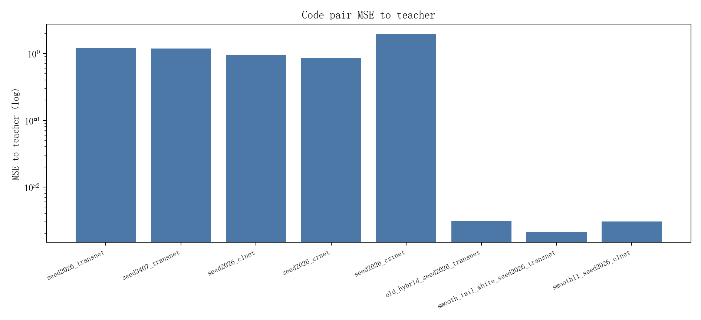

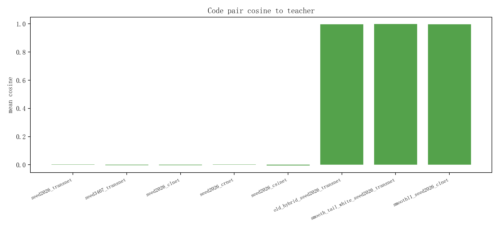

和 `7.54e-4` 的 1 dB 噪声阈值对比：

- `smooth+tail+white` mean MSE 是 `2.093e-3`，仍是阈值的 `2.78x`。
- `smooth+tail+white` sample p95 是 `4.471e-3`，是阈值的 `5.93x`。
- `smooth+tail+white` sample p99 是 `7.449e-3`，是阈值的 `9.88x`。

所以当前不是平均 cosine 不够，而是 sample tail 和少数敏感维度仍明显过大。

线性可对齐性结果：

| source | raw MSE | orthogonal Procrustes MSE | affine MSE | affine cosine |
|---|---:|---:|---:|---:|
| seed2026 transnet | `1.2166` | `5.099e-2` | `2.558e-2` | `0.9812` |
| seed3407 transnet | `1.1806` | `7.239e-2` | `3.503e-2` | `0.9744` |
| seed2026 clnet | `0.9599` | `1.943e-1` | `9.856e-2` | `0.9253` |
| seed2026 crnet | `0.8519` | `2.164e-1` | `9.644e-2` | `0.9268` |
| seed2026 csinet | `1.9664` | `4.625e-1` | `7.539e-2` | `0.9450` |

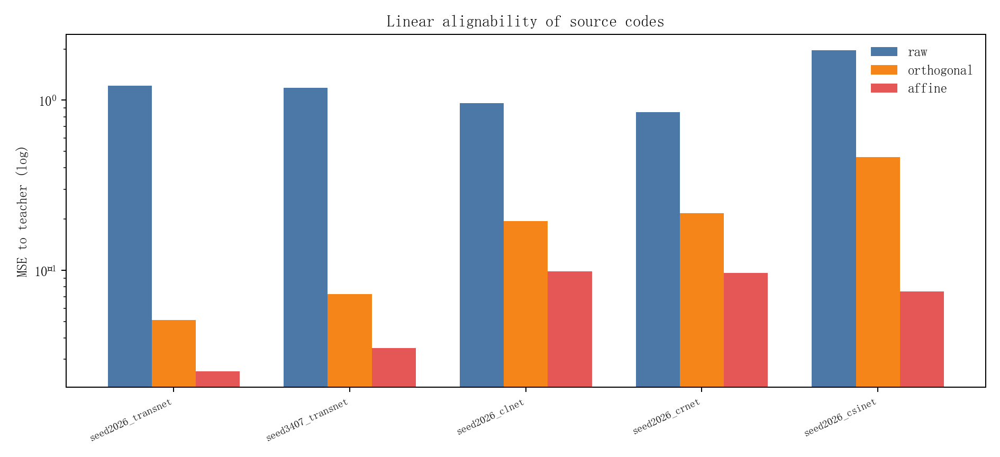

解释：

- 正交 Procrustes 可以把同架构 transnet 的 MSE 从 `1.2166` 降到 `0.0510`，说明随机 seed 间确实有很强的旋转/混合成分。
- 全仿射可以继续降到 `0.0256`，说明尺度、偏置和非正交线性混合也重要。
- 但 `0.0256` 仍比当前 nonlinear mapper 的 `0.00209` 高一个数量级，也比 1 dB 阈值 `7.54e-4` 高约 `34x`。
- 因此 source-to-teacher 不是“固定一个 R 就完事”。即使同架构不同 seed，线性对齐只能做粗配准，后面必须有非线性、样本相关、tail-aware 的 residual correction。

#### 5.2.0.1 `z_t-z_s`、`z_t-Procrustes(z_s)`、`z_t-Affine(z_s)` residual 对比

为回答“先做 Procrustes/affine 粗对齐后再学 residual 是否更好”，本次新增脚本：

```bash
python mapper/analyze_residual_alignment_variants.py --gpu 4
```

输出：

```text
mapper/reports/generative_code_mapping_feasibility/residual_alignment_analysis/
```

三类 residual 定义：

```text
raw residual:        r_raw  = z_t - z_s
Procrustes residual: r_proc = z_t - Procrustes(z_s)
Affine residual:     r_aff  = z_t - Affine(z_s)
```

其中 Procrustes 和 Affine 都是用全量 paired `(z_s, z_t)` 拟合的确定性闭式解，不需要神经网络训练。

核心结果如下：

| source | raw MSE | Procrustes MSE | Affine MSE | raw p95 | Procrustes p95 | Affine p95 | Affine / raw |
|---|---:|---:|---:|---:|---:|---:|---:|
| seed2026 transnet | `1.2166` | `5.099e-2` | `2.558e-2` | `1.9996` | `0.1260` | `0.0628` | `2.10%` |
| seed3407 transnet | `1.1806` | `7.239e-2` | `3.503e-2` | `1.8789` | `0.1702` | `0.0914` | `2.97%` |
| seed2026 clnet | `0.9599` | `1.943e-1` | `9.856e-2` | `1.6295` | `0.4835` | `0.2690` | `10.27%` |
| seed2026 crnet | `0.8519` | `2.164e-1` | `9.644e-2` | `1.4393` | `0.4808` | `0.2636` | `11.32%` |
| seed2026 csinet | `1.9664` | `4.625e-1` | `7.539e-2` | `3.5162` | `0.9274` | `0.1845` | `3.83%` |

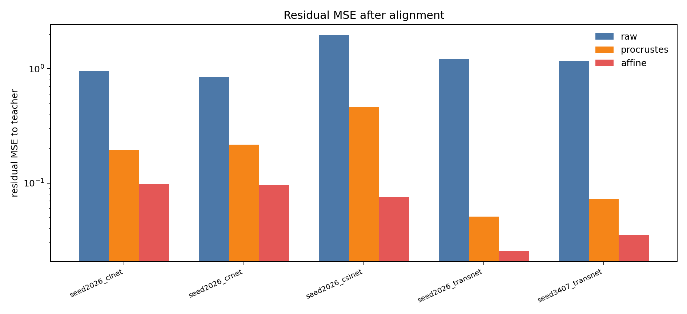

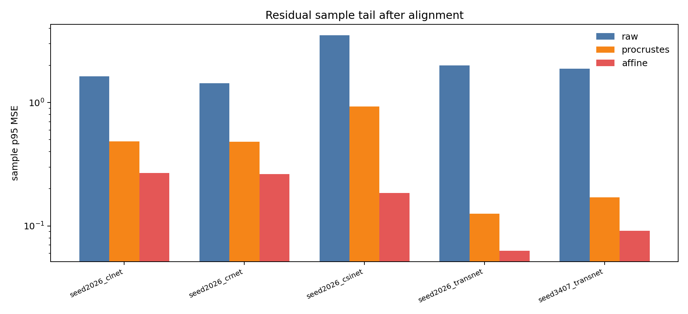

结论非常明确：

1. **Affine residual 在所有 source 上都是三者里最小的。**  
   它不仅降低 mean MSE，也降低 sample p95 tail。对同架构 transnet，Affine 把 residual MSE 压到 raw 的 `2%~3%`；对 csinet 也压到 `3.8%`。

2. **Procrustes 适合作为“随机 seed 旋转成分”的证据，但不是最佳粗对齐。**  
   同架构 transnet 的 Procrustes 降幅很大，说明随机 seed 间有强旋转/反射/正交混合；但 Affine 继续大幅下降，说明尺度、偏置、非正交混合也很关键。

3. **跨架构下，Procrustes 的残差仍然太大。**  
   clnet/crnet 的 Procrustes MSE 分别是 `0.194/0.216`，比 Affine 的 `0.0986/0.0964` 高约 2 倍。说明跨架构不只是正交旋转问题。

4. **Affine 后 residual 仍远高于最终目标。**  
   最好的同架构 Affine MSE `2.558e-2`，仍比 code-only mapper 当前最好 `1.767e-3` 高约 `14.5x`，比 1 dB 阈值 `7.54e-4` 高约 `34x`。所以 Affine 只能做 coarse alignment，不能替代 mapper。

残差结构也发生明显变化：

| source | raw rank | Procrustes rank | Affine rank | raw dim max | Procrustes dim max | Affine dim max |
|---|---:|---:|---:|---:|---:|---:|
| seed2026 transnet | `54.7` | `100.5` | `81.3` | `2.361` | `0.288` | `0.213` |
| seed3407 transnet | `49.1` | `105.5` | `88.2` | `2.056` | `0.343` | `0.235` |
| seed2026 clnet | `77.6` | `12.4` | `3.31` | `2.283` | `1.098` | `1.060` |
| seed2026 crnet | `71.9` | `15.1` | `3.31` | `2.067` | `1.099` | `1.047` |
| seed2026 csinet | `77.7` | `44.6` | `31.2` | `3.105` | `1.084` | `0.516` |

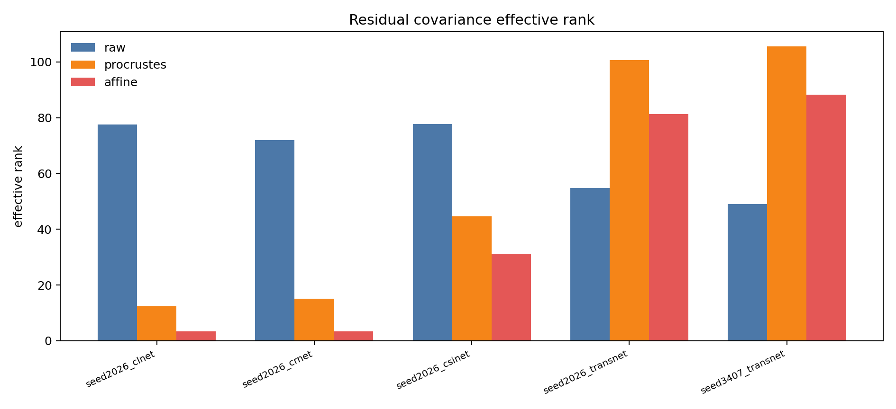

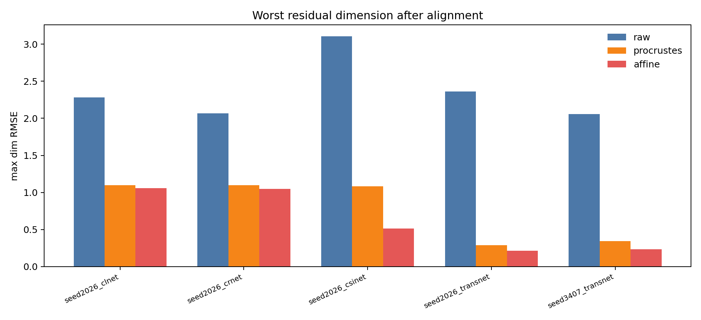

这里有一个重要现象：

- 同架构 transnet 的 Procrustes/Affine residual rank 反而比 raw residual 更高，说明粗对齐消掉了大尺度均值/旋转差异后，剩余误差更分散，是很多维度的小误差。
- clnet/crnet 的 Affine residual rank 只有约 `3.31`，top10 residual PCA energy 超过 `70%`，说明跨架构经过 Affine 后的残差高度低秩、结构化。这对 residual mapper 或 flow matching 很有利，因为后续不是从完整高维 transport 开始学，而是在少数主残差方向上细修。
- 但 clnet/crnet 的 `dim_rmse_max` 仍约 `1.05`，说明有少数 code 维度/方向残差极大，后续必须压 dim tail，否则 fixed decoder 仍可能敏感。

对后续建模的直接建议：

```text
优先使用 Affine(z_s) 作为 z0；
不要直接学 z_t - z_s；
也不要只用 Procrustes，除非你想做可解释的“纯旋转”消融。
```

推荐训练目标改成：

```text
z0 = Affine(z_s)                       # fixed closed-form coarse alignment
residual_target = z_t - z0             # teacher-like 坐标系里的 residual
z_hat = z0 + residual_model(z_s, z0)
```

如果用 flow matching，更合理的是学：

```text
x_0 = z0
x_1 = z_t
x_t = (1 - t) x_0 + t x_1
v_target = x_1 - x_0
```

而不是：

```text
noise -> z_t
```

原因是 Affine 后的 `z0` 已经进入 teacher-like 坐标系，`z_t-z0` 的逐维 residual 才有明确意义；raw `z_t-z_s` 中 512 维坐标并不天然对应，直接学 raw residual 会把“坐标系对齐”和“细修”混在一起。

残差分布实测：

| residual | effective rank | top10 energy | top50 energy | kurtosis | normal NLL | Laplace NLL |
|---|---:|---:|---:|---:|---:|---:|
| raw seed2026 transnet | `54.71` | `0.299` | `0.658` | `0.35` | `1.517` | `1.551` |
| old hybrid mapped | `39.52` | `0.327` | `0.533` | `24.75` | `-1.474` | `-1.628` |
| smooth+tail+white mapped | `13.83` | `0.422` | `0.540` | `110.23` | `-1.657` | `-1.779` |
| smoothl1 clnet mapped | `18.32` | `0.394` | `0.519` | `85.15` | `-1.480` | `-1.594` |

结论：

- raw source residual 更接近普通分布，Normal NLL 甚至略好于 Laplace。
- mapped residual 的 kurtosis 极高，Laplace NLL 明显低于 Normal NLL，说明 mapper 把大部分误差压小后，剩下的是尖峰重尾残差。
- `smooth+tail+white` 把 residual effective rank 压到 `13.83`，top10 energy 到 `0.422`，说明剩余误差更结构化、更集中。这对 residual flow/refinement 是好消息，因为它有可学习结构；但极高 kurtosis 表示尾部样本仍是瓶颈。

综合判断：

```text
全局分布已经像 teacher；
线性配准能解释一部分旋转，但远远不够；
nonlinear mapper 已经有效，但 residual tail 仍高于 fixed decoder 可容忍阈值；
下一步最值得做的是针对 residual tail、dim max、decoder-sensitive direction 的细修，而不是只追求更像 teacher 的边缘分布。
```

#### 5.2.1 raw source 与 teacher 的对齐程度

对每个 source：

```text
MSE(z_s, z_t)
cos(z_s, z_t)
||z_s|| / ||z_t||
```

已有结果显示 raw cosine 接近 0：

| source | raw MSE | raw cosine |
|---|---:|---:|
| seed2026/transnet | `1.2129` | `0.0018` |
| seed3407/transnet | `1.1768` | `-0.0024` |
| seed2026/clnet | `0.9567` | `-0.0033` |
| seed2026/crnet | `0.8492` | `0.0026` |
| seed2026/csinet | `1.9618` | `-0.0055` |

这说明 baseline source code 与 teacher code 不是小偏移，而是完整高维坐标不对齐。

#### 5.2.2 线性可对齐性

先做几个强 baseline：

```text
z_a = A z_s + b
z_a = Procrustes(z_s)
z_a = CCA / whiten-color transform
z_a = low-rank A z_s + b
```

判断：

- 如果线性已经到 `1e-3` 以下，非线性 mapper 只需要细修。
- 如果线性远差，说明 source/teacher code manifold 不只是旋转缩放。

#### 5.2.3 残差分布

对：

```text
r_i = z_a_i - z_t_i
```

分析：

- 全局 histogram。
- Normal / Laplace / Student-t fit。
- QQ plot。
- kurtosis。
- sample MSE CDF。
- dim RMSE 排序。

已有结果表明 residual 重尾，Laplace 往往比 Normal 拟合更好。因此训练 loss 需要关注尾部，不应只看均值。

#### 5.2.4 teacher PCA 坐标中的 residual

计算 teacher code covariance：

```text
cov_t = cov(z_t)
cov_t = P Lambda P^T
r_pca = r P
```

分析：

- residual 是否主要落在 teacher 高方差方向。
- residual 是否在 teacher 低方差方向异常大。
- whitened residual：

```text
sum_j r_pca_j^2 / (lambda_j + eps)
```

用途：

- 普通 MSE 会忽略低方差方向，但 decoder 可能依赖这些方向。
- 这解释了为什么 `lambda_whiten` 有必要，但要小心 dim tail 上升。

#### 5.2.5 decoder-sensitive residual

至少做三层：

第一层：

```text
fc_delta = fc_decoder(z_a) - fc_decoder(z_t)
```

全 decoder：

```text
rec_delta = D_t(z_a) - D_t(z_t)
```

局部 Jacobian：

```text
J_D(z_t) r
```

用随机向量、residual PCA 主方向、teacher PCA 主方向做 JVP/VJP，估计哪些 code 方向最敏感。

用途：

- 如果 residual MSE 不大但 `rec_delta` 大，说明误差落在 decoder 高增益方向。
- loss 应增加 `lambda_fc`、`lambda_recT` 或 Jacobian-weighted code loss。

### 5.3 decoder 参数与层分析

当前 fixed decoder 的结构入口是：

```text
code(512) -> fc_decoder(2048) -> TransformerDecoder -> CSI(2,32,32)
```

应分析：

#### 5.3.1 `fc_decoder.weight` 奇异值

本次当前 seed42 fixed decoder：

```text
shape = 2048 x 512
sv_max = 5.112
sv_median = 1.310
sv_min = 0.779
```

含义：

- 第一层不是等距映射。
- max singular direction 的 code residual 会被放大约 5 倍进入 2048 维特征。
- 普通 code MSE 对所有方向等权，不符合 decoder 感知距离。

#### 5.3.2 layerwise feature delta

保存：

```text
fc output
decoder layer 0 output
decoder layer 1 output
final reconstruction
```

分别比较：

```text
feature_delta_l = h_l(z_a) - h_l(z_t)
```

用途：

- 定位误差主要在哪一层被放大。
- 如果 fc 后已经很大，优先 `lambda_fc`。
- 如果 fc 后不大但 Transformer 后变大，需要 deeper feature consistency。

#### 5.3.3 decoder local Lipschitz / Jacobian spectrum

对每个样本近似：

```text
||D_t(z_t + epsilon v) - D_t(z_t)|| / ||epsilon v||
```

其中 `v` 取：

- random direction。
- residual direction。
- teacher PCA directions。
- `fc_decoder` top singular vectors。

用途：

- 判断 current mapper residual 是否恰好落在高敏感方向。
- 确定 code loss 是否需要按敏感度加权。

---

## 6. 推荐方案设计

### 6.1 不建议第一步就训练 DDPM 式随机采样模型

对 paired code translation：

```text
z_s -> z_t
```

目标是精确对齐，而不是生成多样性。随机 diffusion 采样会带来额外方差。fixed decoder 对噪声很敏感，teacher 加噪声实验已经说明：

```text
code MSE ≈ 7.54e-4 就会掉 1 dB
```

因此第一版应使用 deterministic 输出：

- MLP/residual transformer mapper。
- rectified flow / flow matching 的 ODE deterministic sampler。
- diffusion 也应取 posterior mean / DDIM deterministic sampler，而不是随机采样多个 code。

### 6.2 第一阶段：强 deterministic residual mapper

推荐结构：

```text
z0 = coarse_mapper(z_s)
r  = residual_net([z_s, z0, z0 - z_s, optional c_s])
z_a = z0 + alpha * r
```

其中：

- `coarse_mapper` 可以是 affine/flow/MLP。
- `residual_net` 负责细修非线性和尾部。
- `alpha` 初始小一些，例如 `0.05~0.1`，避免一开始破坏粗对齐。

loss：

```text
L = MSE(z_a, z_t)
  + lambda_sample_tail * topq_sample_MSE
  + lambda_dim_tail    * topq_dim_MSE
  + lambda_whiten      * teacher_PCA_whitened_MSE
```

目标：

```text
mean code MSE <= 5e-4
sample p95 接近或低于 1e-3
dim RMSE max 明显下降
```

如果 deterministic mapper 达不到这个目标，直接上 diffusion 大概率也不会解决本质问题，因为 diffusion 仍要学习同一个 pairwise mapping。

### 6.3 第二阶段：conditional rectified flow / flow matching on residual

如果 deterministic mapper 后 residual 仍重尾，可以把生成式模型用在 residual refinement 上，而不是直接从噪声生成完整 512 维 code。

定义：

```text
r = z_t - z0
```

训练 rectified flow：

```text
x_0 ~ simple noise 或 residual prior
x_1 = r
x_t = (1 - t) x_0 + t x_1
v_theta(x_t, t, z_s, z0, c_s) ≈ x_1 - x_0
```

推理：

```text
从 x_0=0 或小噪声出发
ODE 积分得到 r_hat
z_a = z0 + r_hat
```

为什么比 DDPM 更适合当前任务：

- 输出是连续 residual，flow matching 直接学习速度场。
- 可以用少步 ODE，推理成本低。
- 可以设置 deterministic path，减少采样噪声。
- residual 维度 512，远小于 adapter 权重百万维。

### 6.4 第三阶段：decoder-aware refinement

如果最终指标是 fixed decoder NMSE，必须进入 decoder-aware 阶段。仅 code-only 到 `2e-3` 已经证明不够。

推荐 loss：

```text
L = lambda_code * MSE(z_a, z_t)
  + lambda_fc   * MSE(fc_t(z_a), fc_t(z_t))
  + lambda_recT * MSE(D_t(z_a), D_t(z_t))
  + lambda_rec  * MSE(D_t(z_a), x)
  + lambda_tail * topq_sample_rec_error
```

训练策略：

1. code-only 预训练到稳定。
2. 降低学习率，例如 `5e-4 -> 5e-5` 或 `1e-4`。
3. 开启 `lambda_fc/lambda_recT`。
4. 保留小权重 `lambda_code`，防止 code 离开 teacher manifold。
5. 最终按 fixed decoder NMSE 选 checkpoint，而不是只按 code MSE。

注意：你之前说“当前阶段不加 decoder 信息 loss”，这是一个清晰实验阶段划分。但报告结论必须强调：**只要最终要过 fixed decoder，decoder-aware 是第二阶段不可避免的。**

### 6.5 set condition 应该怎么用

如果你为每个 source 单独训练 mapper：

```text
seed2026 transnet -> seed42 transnet
```

那么不一定需要 set condition，因为所有样本都来自同一个 source encoder，mapper 参数本身已经吸收了 source 坐标系。

如果你想训练一个 universal mapper：

```text
G_theta(z_s, c_s) -> z_t
```

让同一个模型适配不同 seed/架构，那么 `c_s = summary({z^s_i})` 才有必要。

推荐从简单到复杂：

1. `c_s = [mean, std, PCA eigenvalues, top PCA vectors]`。
2. `c_s = K-means prototypes + weights`。
3. `c_s = DeepSets summary`。
4. `c_s = Perceiver/SetTransformer latent tokens`。

但要注意：如果只给 source set summary，而不给任何 teacher anchor，`c_s` 只能描述 source 分布，不能唯一确定 teacher 坐标。因此 universal mapper 最好训练在多个 source tasks 上，并且每个 task 有 paired teacher code。

### 6.6 建议实验矩阵

第一组：确定性强 baseline。

```text
MLP residual
affine + residual MLP
flow + residual MLP
coarse affine + gated residual MLP
```

第二组：code-only loss ablation。

```text
MSE
MSE + sample_tail
MSE + dim_tail
MSE + whiten
MSE + sample_tail + dim_tail + whiten
```

第三组：生成式 residual refinement。

```text
deterministic residual net
rectified flow residual, x0=0
rectified flow residual, x0=Gaussian small noise
diffusion residual, deterministic DDIM
```

第四组：set-conditioned universal mapper。

```text
no context
mean/std context
PCA context
prototype context
DeepSets context
SetTransformer/Perceiver context
```

第五组：decoder-aware finetune。

```text
lambda_code + lambda_fc
lambda_code + lambda_recT
lambda_code + lambda_fc + lambda_recT
lambda_code + lambda_fc + lambda_recT + lambda_rec
```

每组都至少记录：

```text
code MSE
sample p95/p99 code MSE
dim RMSE max
cosine
fc MSE
recT MSE
fixed decoder train/test NMSE
```

---

## 7. 训练生成式模型时的注意事项

### 7.1 不要把随机性当成收益

如果目标是固定 decoder 可解码，随机采样通常是风险：

```text
z_a = mean prediction + sampling noise
```

任何额外 noise 都可能造成 NMSE 下降。生成式模型应优先使用 deterministic sampler。

### 7.2 归一化必须固定在 teacher 坐标系

如果对 code 做标准化：

```text
z_norm = (z - mean) / std
```

建议用 teacher train code 的统计量作为 target 坐标规范，而不是每个 source 各自统计。否则不同 source 又会引入自己的坐标尺度。

### 7.3 checkpoint 选择要同时保存 best code MSE 和 best decoder NMSE

当前你已经把 `best_loss` 和 `best_mse` 同时保存，这是对的。后续 decoder-aware 阶段还应保存：

```text
best_code_mse.pth
best_recT.pth
best_fixed_decoder_nmse.pth
```

因为 code MSE 最小不一定 fixed decoder NMSE 最好。

### 7.4 全量对齐可以不分 test，但模型设计仍要有 held-out task

如果目标是当前这 100000 条用户全量对齐，`val_ratio=0` 是合理的。

但如果目标是证明方法能泛化到新 seed/新架构/新场景，则必须有 held-out source task：

```text
train sources: seed A/B/C, arch A/B
test source: unseen seed/arch
```

否则 set-conditioned generator 可能只是记住某个 source-to-teacher mapping。

### 7.5 评价不能只看平均 MSE

必须同时看：

- mean code MSE。
- sample p95/p99。
- dim RMSE max。
- residual PCA。
- residual fit / QQ。
- fixed decoder NMSE。
- decoder output delta：

```text
NMSE(D_t(z_a), D_t(z_t))
```

因为当前瓶颈已经从“能不能粗对齐”变成“尾部和敏感方向能不能压住”。

---

## 8. 最终判断

### 8.1 对原始 adapter 权重生成

可作为长期研究方向，但当前不建议作为主路线。

原因：

```text
adapter 权重空间有严重对称性；
百万级参数生成需要大量 task-level 权重样本；
当前主要瓶颈是 code 到 fixed decoder 的精确对齐，
直接生成权重绕了一层。
```

如果以后要做，建议只生成低维 adapter latent 或少量参数：

```text
gate / bias / lowrank U,V / LoRA-like delta
```

并且评价用 function-space loss：

```text
MSE(A_theta(z_s), z_t)
MSE(D_t(A_theta(z_s)), x)
```

不要用 raw weight MSE。

### 8.2 对直接生成/映射 fixed decoder code

这是当前更可靠的方向。

但我建议把它命名为：

```text
conditional code translator
```

而不是一开始叫 diffusion generator。因为在你的 paired data 场景下，最重要的是精确回归，不是多样性生成。

推荐路线：

```text
阶段 1：deterministic residual mapper，把 code MSE 压到 <= 5e-4
阶段 2：tail/whiten/dim-sensitive code-only loss，压 p95/p99 和 dim max
阶段 3：如 residual 仍重尾，再上 rectified-flow residual refinement
阶段 4：接 fixed decoder 做 decoder-aware finetune，冲 1 dB gap
阶段 5：如果要跨 seed/架构通用，再加入 set summary conditioner
```

### 8.3 可靠性边界

这个方案可靠的前提：

```text
有 paired teacher code 或 fixed decoder reconstruction anchor；
训练目标包含足够强的 code 精确对齐；
最终用 fixed decoder NMSE 验证；
residual mean、tail、decoder-sensitive directions 都被压住。
```

不可靠的情况：

```text
只有 source code set，没有 teacher/code/reconstruction anchor；
用随机 diffusion sampling 直接生成 code；
只优化分布匹配，不优化样本级 pairwise MSE；
只看 cosine/mean MSE，不看 p95/p99 和 fixed decoder NMSE。
```

一句话结论：

```text
直接生成 fixed decoder 可识别码字，是比生成 adapter 权重更务实的路线；
但它必须先在 code MSE 上达到 1e-4~5e-4 量级，
并最终引入 decoder-aware 约束，才有希望把 NMSE gap 缩到 1 dB 以内。
```

---

## 9. 参考资料

本报告结合了项目内实验与以下代表性工作：

- Deep Sets: permutation-invariant set function 建模。https://arxiv.org/abs/1703.06114
- Set Transformer: attention-based permutation-invariant set modeling。https://arxiv.org/abs/1810.00825
- Perceiver / Perceiver IO: latent bottleneck 处理大规模输入。https://arxiv.org/abs/2103.03206 ，https://arxiv.org/abs/2107.14795
- The Neural Statistician: dataset/set-level latent variable。https://arxiv.org/abs/1606.02185
- HyperNetworks: 用网络生成网络权重。https://arxiv.org/abs/1609.09106
- Git Re-Basin: neural network 权重置换对称与模型合并。https://arxiv.org/abs/2209.04836
- Flow Matching for Generative Modeling。https://arxiv.org/abs/2210.02747
- Rectified Flow / Flow Straight and Fast。https://arxiv.org/abs/2209.03003
- Denoising Diffusion Probabilistic Models。https://arxiv.org/abs/2006.11239
- Score-Based Generative Modeling through SDEs。https://arxiv.org/abs/2011.13456
- Learning to Learn with Generative Models of Neural Network Checkpoints。https://arxiv.org/abs/2209.12892
- HyperDiffusion / weight-space diffusion 相关方向。https://arxiv.org/abs/2303.17015

项目内主要依据：

- `mapper/reports/mapper_exps_full_analysis.md`
- `mapper/reports/mapper_loss_design_analysis.md`
- `mapper/reports/teacher_noise_sensitivity/README.md`
- `mapper/reports/codeword_analysis/codeword_analysis.md`
- `mapper/reports/mapper_distribution_analysis/`
- `mapper/reports/mapper_advanced_analysis/`
- `docs/encoder_canonical_full_experiment_report.md`
- `docs/set_conditioned_adapter_weight_generation.md`
- `docs/adapter_cross_seed_diagnostics.md`
- `mapper/reports/generative_code_mapping_feasibility/local_summary.json`
- `mapper/analyze_csi_code_deep_dive.py`
- `mapper/reports/generative_code_mapping_feasibility/csi_code_deep_dive/summary.json`
- `mapper/analyze_residual_alignment_variants.py`
- `mapper/reports/generative_code_mapping_feasibility/residual_alignment_analysis/summary.json`
