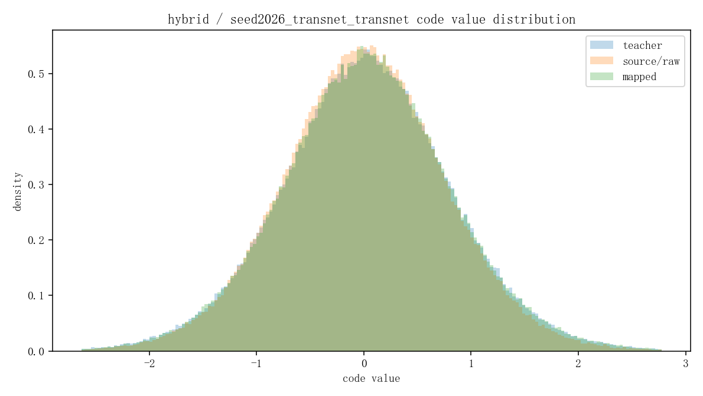
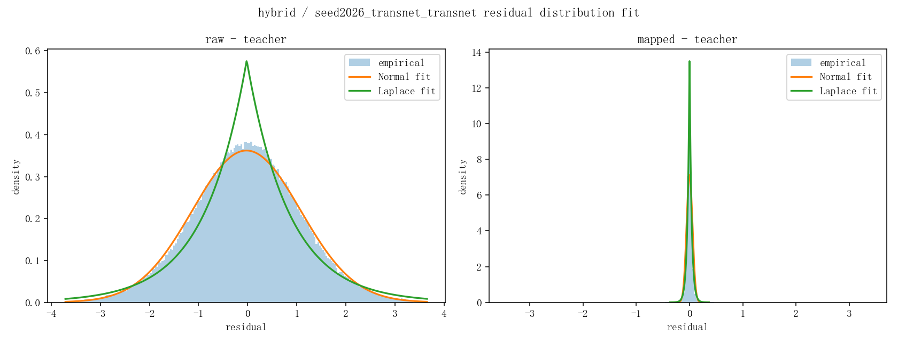
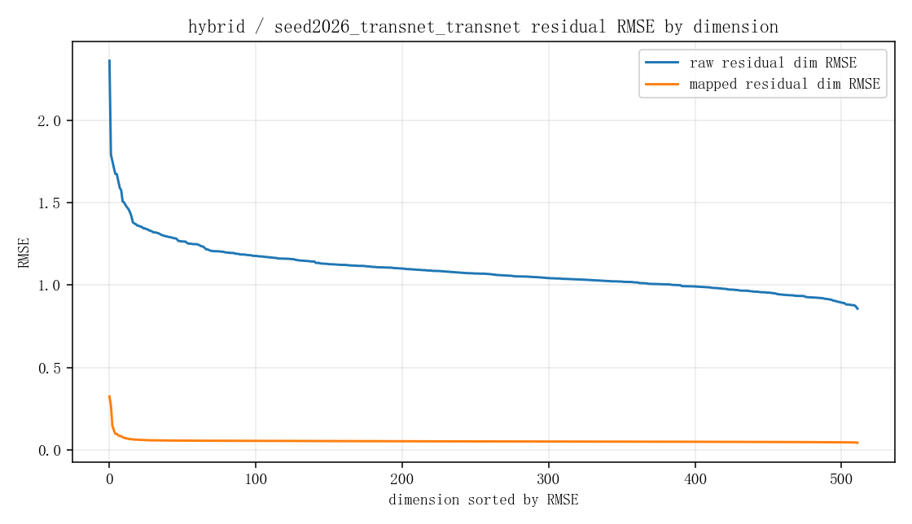
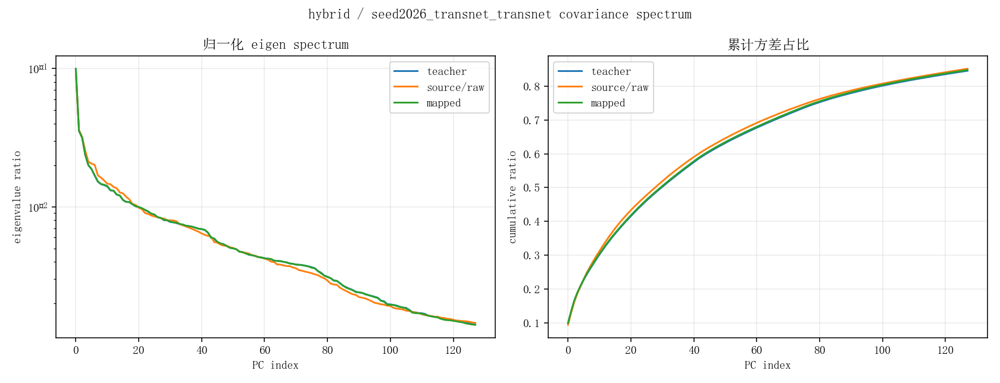
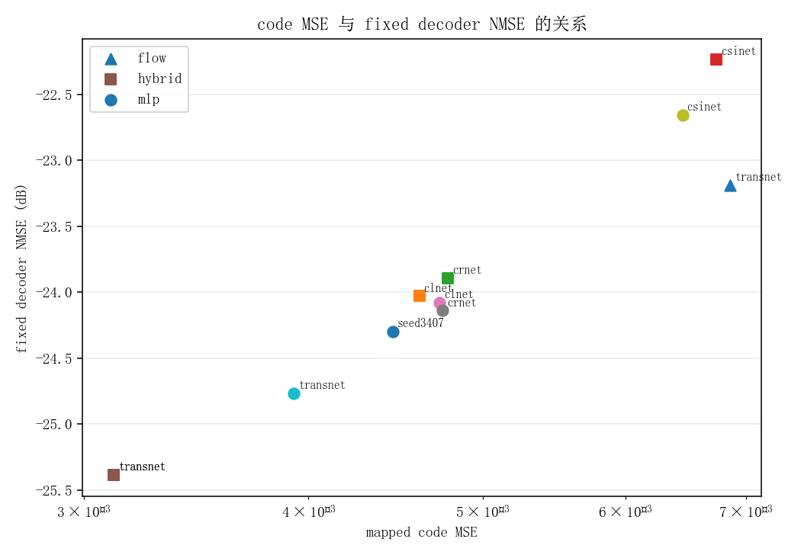
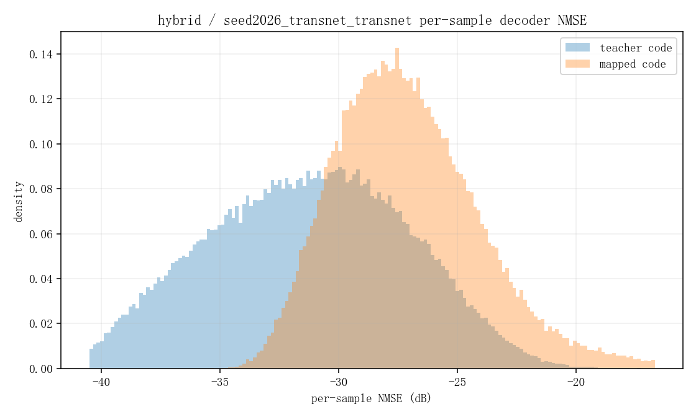
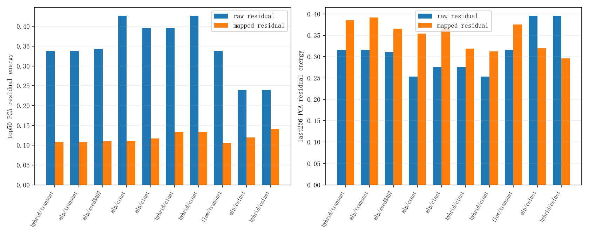
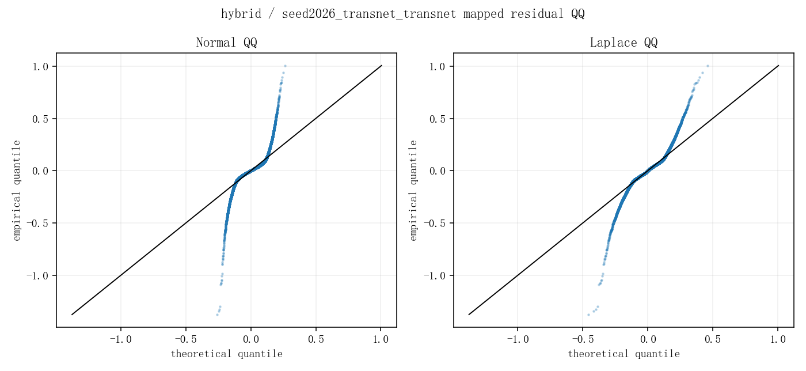

# mapper/exps 实验结果与增强方案分析

本文分析 `mapper/exps` 下已经跑完的 codeword mapper 实验，并结合固定 seed42 `transnet` decoder 解码后的真实 NMSE 判断 mapper 是否足够用于固定 decoder 适配。

固定 teacher 与 decoder：

- teacher code：`exps/COST2100/in/seed42/transnet_transnet/codewords/train_code.pt`
- fixed decoder：`exps/COST2100/in/seed42/transnet_transnet/checkpoints/best_nmse.pth`
- 解码数据：`/storage/hujiacong/zxd/datasets/cost2100/in_train.pt`
- 样本数：`100000`
- code 维度：`512`

## 1. 核心结论

当前 mapper 已经证明：不约束 baseline encoder/decoder 训练时，后训练 mapper 仍然可以把不同 seed/架构 encoder 产生的 codeword 大幅拉近到 seed42 teacher code 坐标系。

但是，如果目标是“mapped code 直接送进 seed42 fixed decoder，并让重建 NMSE 距离 teacher 1 dB 以内”，当前结果还不够。teacher code 自己解码是 `-29.10 dB`，当前最好的 mapped code 解码是 `-25.39 dB`，差距约 `3.72 dB`。

这说明 mapper 的 code MSE/cosine 已经改善很多，但误差仍然落在 fixed decoder 敏感方向上。后续只继续优化 `MSE(mapper(z_s), z_t)` 的收益会有限，必须把 decoder-aware loss 引入 mapper 训练。

## 2. 原始 codeword 差距

在没有 mapper 前，不同 source code 与 seed42 teacher code 几乎是正交关系。raw cosine 都接近 0，说明不同 encoder 的 code 坐标系不是简单的尺度偏移，而是整体坐标旋转、混合和分布差异。

| source | raw MSE | raw cosine | 说明 |
|---|---:|---:|---|
| seed2026/transnet_transnet | 1.2129 | 0.0018 | 同架构不同 seed，坐标系已经基本不对齐 |
| seed3407/transnet_transnet | 1.1768 | -0.0024 | 同架构不同 seed，同样接近正交 |
| seed2026/clnet_transnet | 0.9567 | -0.0033 | 跨架构，raw MSE 略低但方向不对齐 |
| seed2026/crnet_transnet | 0.8492 | 0.0026 | 跨架构，raw MSE 最低但 cosine 仍接近 0 |
| seed2026/csinet_transnet | 1.9618 | -0.0055 | 跨架构最难，对齐前差距最大 |

raw MSE 不能单独代表难度。比如 crnet raw MSE 比 transnet 小，但 mapped code 解码 NMSE 不一定更好，因为 fixed decoder 真正在意的是 code 误差经过 decoder Jacobian 后的重建误差。

## 3. mapper code 对齐结果

下面的 `all code MSE/cos` 是 mapper 输出 `mapped_code.pt` 与 teacher code 的全量 code 级指标。注意当前训练仍使用 `90% train + 10% val`，所以 `all code MSE` 包含训练样本，通常会比 `best val MSE` 更乐观。

| mapper | source | 参数量 | best val MSE | best epoch | all code MSE | all code cosine | code NMSE |
|---|---|---:|---:|---:|---:|---:|---:|
| hybrid | seed2026/transnet | 23.11M | 0.01447 | 259 | 0.00312 | 0.99767 | -24.49 dB |
| mlp | seed2026/transnet | 8.40M | 0.01172 | 377 | 0.00392 | 0.99703 | -22.64 dB |
| mlp | seed3407/transnet | 8.40M | 0.01267 | 293 | 0.00445 | 0.99663 | -22.03 dB |
| mlp | seed2026/clnet | 8.40M | 0.01414 | 400 | 0.00473 | 0.99642 | -21.82 dB |
| mlp | seed2026/crnet | 8.40M | 0.01424 | 400 | 0.00475 | 0.99641 | -21.81 dB |
| hybrid | seed2026/clnet | 23.11M | 0.02212 | 334 | 0.00461 | 0.99656 | -22.90 dB |
| hybrid | seed2026/crnet | 23.11M | 0.02271 | 388 | 0.00478 | 0.99642 | -22.71 dB |
| mlp | seed2026/csinet | 8.40M | 0.02081 | 385 | 0.00645 | 0.99514 | -20.58 dB |
| hybrid | seed2026/csinet | 23.11M | 0.02996 | 159 | 0.00674 | 0.99500 | -21.03 dB |
| flow | seed2026/transnet | 14.70M | 0.01903 | 202 | 0.00686 | 0.99467 | -20.12 dB |

主要观察：

1. 同架构不同 seed 的 code 对齐明显更容易。`seed2026/transnet -> seed42/transnet` 最好，hybrid mapper 的 all code MSE 到 `3.12e-3`。
2. 跨架构也能对齐到 cosine `0.995~0.997`，说明 mapper 确实学到了主要坐标变换。
3. 纯 `flow` 在 code MSE 和固定 decoder NMSE 上都弱于 MLP/hybrid，说明 source code 到 teacher code 不是一个干净的可逆坐标变换，可能需要非可逆的投影、压缩或残差修正。
4. `mlp` 参数少但很强，在 clnet/crnet 上甚至比 hybrid 的 fixed decoder NMSE 略好。
5. `best epoch=400` 的实验还在下降或至少没有明显收敛，特别是 `mlp/clnet` 和 `mlp/crnet`，可以继续训练或改成第二阶段 decoder-aware finetune。

## 4. fixed decoder 解码 NMSE

下面是把 `mapped_code.pt` 直接送入 seed42 fixed decoder 后，在全量 train CSI 上计算的重建 NMSE。

| code 来源 | fixed decoder NMSE | 距 teacher 差距 | decoder MSE loss |
|---|---:|---:|---:|
| teacher code | -29.10 dB | 0.00 dB | 5.55e-7 |
| hybrid / seed2026 transnet | -25.39 dB | 3.72 dB | 1.31e-6 |
| mlp / seed2026 transnet | -24.76 dB | 4.34 dB | 1.51e-6 |
| mlp / seed3407 transnet | -24.30 dB | 4.81 dB | 1.68e-6 |
| mlp / seed2026 crnet | -24.14 dB | 4.96 dB | 1.74e-6 |
| mlp / seed2026 clnet | -24.08 dB | 5.03 dB | 1.77e-6 |
| hybrid / seed2026 clnet | -24.03 dB | 5.07 dB | 1.79e-6 |
| hybrid / seed2026 crnet | -23.89 dB | 5.21 dB | 1.84e-6 |
| flow / seed2026 transnet | -23.19 dB | 5.91 dB | 2.17e-6 |
| mlp / seed2026 csinet | -22.66 dB | 6.45 dB | 2.45e-6 |
| hybrid / seed2026 csinet | -22.24 dB | 6.87 dB | 2.70e-6 |

重要结论：

1. code MSE 和 decoder NMSE 有正相关，但不是完全一致。fixed decoder 对不同 code 方向的敏感度不同。
2. `hybrid/seed2026 transnet` code MSE 最好，decoder NMSE 也最好，但仍离 teacher 差 `3.72 dB`。
3. clnet/crnet 跨架构结果已经接近 `-24 dB`，说明后训练 mapper 路线可行，但要进 1 dB 以内还需要 decoder-aware 训练。
4. csinet 明显最难，raw code 差距最大，mapped 后 fixed decoder NMSE 也最差。

## 5. 异常结果说明

`mapper/exps/hybrid/seed3407_transnet_transnet_to_seed42_transnet_code_mse0.0_cov0.0_lr5e-4_ep400` 不能作为 seed3407 hybrid 结果使用。

原因：

- 目录名是 `seed3407_transnet_transnet`；
- 但 `args.json` 中真实 `source_code` 是 `exps/COST2100/in/seed2026/transnet_transnet/codewords/train_code.pt`；
- 该目录的 `mapped_code.pt` 与 `hybrid/seed2026_transnet.../mapped_code.pt` 完全相同；
- `max_abs_diff = 0.0`，`MSE = 0.0`。

所以当前有效的 seed3407 结果只有 `mlp/seed3407_transnet...`。

## 6. 为什么 code MSE 已经很低，decoder NMSE 仍差 3-7 dB

当前最好的 hybrid mapper：

```text
all code MSE = 3.12e-3
all code cosine = 0.99767
fixed decoder NMSE = -25.39 dB
teacher decoder NMSE = -29.10 dB
```

`3.12e-3` 的每维 RMSE 约为：

```text
sqrt(3.12e-3) ≈ 0.056
```

对 512 维 code 来说，这仍然不是一个很小的扰动。更关键的是 decoder 不是等距映射。对 fixed decoder `D_t`，在 teacher code `z_t` 附近有一阶近似：

```text
D_t(z_a) - D_t(z_t) ≈ J_D(z_t) (z_a - z_t)
```

普通 code MSE 优化的是：

```text
||z_a - z_t||^2
```

但 fixed decoder 真正在意的是：

```text
||J_D(z_t)(z_a - z_t)||^2
```

如果 mapper 的残余误差落在 decoder 的高增益方向，即使 code cosine 很高，重建 NMSE 也会明显变差。因此，后续要缩小到 1 dB 内，不能只做 code MSE，必须让 loss 直接经过 fixed decoder。

## 7. mapper 增强方案

### 7.1 decoder-aware loss

最优先建议实现。当前训练目标主要是：

```text
L_code = MSE(z_a, z_t)
```

其中：

```text
z_s = source code
z_t = teacher code
z_a = mapper(z_s)
D_t = fixed seed42 decoder
x = ground-truth CSI
```

建议改成：

```text
L = λ_code * MSE(z_a, z_t)
  + λ_rec  * MSE(D_t(z_a), x)
  + λ_recT * MSE(D_t(z_a), D_t(z_t))
  + λ_fc   * MSE(fc_t(z_a), fc_t(z_t))
```

各项作用：

- `λ_code`：保持全局坐标对齐，防止 mapper 偏离 teacher code manifold 太远。
- `λ_rec`：直接优化最终真实重建 NMSE，是最终任务最相关的项。
- `λ_recT`：让 mapped code 经过 fixed decoder 后模仿 teacher code 的 decoder 输出，本质是 decoder Jacobian 加权 code loss。
- `λ_fc`：约束 decoder 第一层 `fc_decoder` 后的 2048 维 coarse feature，通常比只约束 512 维 code 更接近 decoder 的敏感空间。

推荐先跑：

```text
λ_code = 1.0
λ_recT = 1.0
λ_fc   = 1e-2
λ_rec  = 0.0 或 1.0
```

如果最终目标是固定 decoder 的真实重建 NMSE，`λ_rec` 应该开启。如果担心 mapper 偏离 teacher code 空间，先用 `λ_recT + λ_fc`，再小权重加入 `λ_rec`。

### 7.2 两阶段训练

当前 mapper 一开始就只做 code MSE。更合理的是两阶段：

第一阶段：粗对齐。

```text
L = MSE(z_a, z_t)
```

目标是把 raw cosine 从 0 拉到 0.995 以上。

第二阶段：decoder-aware finetune。

```text
L = 0.1 * MSE(z_a, z_t)
  + 1.0 * MSE(D_t(z_a), D_t(z_t))
  + 1e-2 * MSE(fc_t(z_a), fc_t(z_t))
  + 0~1.0 * MSE(D_t(z_a), x)
```

第二阶段学习率建议降到第一阶段的 `0.1~0.2`，例如从 `5e-4` 降到 `5e-5` 或 `1e-4`。

原因是第一阶段已经学到全局坐标变换，第二阶段只需要修正 decoder 敏感方向，不应该大幅破坏 code 空间。

### 7.3 全量训练模式

当前实验用 `val_ratio=0.1`，最终 `mapped_code.pt` 是 best-val model 在全量数据上的输出。这个设计适合调参，但你的目标是“全量对齐”，不是泛化测试。

最终冲 fixed decoder NMSE 时建议支持：

```text
val_ratio = 0
```

含义：

- 100000 个样本全部用于训练；
- 不再用 val 选 best；
- 保存最后一轮模型；
- 训练结束后导出全量 `mapped_code.pt`。

这样更符合当前任务设定。调结构时仍可以保留 90/10，最终定稿再全量训练。

### 7.4 residual correction after coarse mapper

当前 `hybrid = flow + residual MLP` 已经优于纯 flow，说明“粗坐标变换 + 非线性残差修正”方向是对的。

建议进一步显式化为：

```text
z0 = coarse_mapper(z_s)
δz = residual_mlp([z_s, z0, z0 - z_s])
z_a = z0 + gate * δz
```

其中 `gate` 初始化为 `0.05~0.1`。这样残差模块只做细修，不会一开始破坏已经学到的主坐标变换。

可选 coarse mapper：

- `MLP`：参数少，当前跨架构表现稳定；
- `Flow`：适合先学整体可逆变换；
- `Affine + MLP`：如果后续发现 flow 性价比低，可以替代 flow。

### 7.5 per-dimension affine calibration

在 mapper 最后加一层逐维仿射：

```text
z_out = γ * z + β
```

初始化建议用训练集统计量：

```text
γ = std(z_t) / std(z)
β = mean(z_t) - γ * mean(z)
```

这个模块参数很少，但可能很有效。fixed decoder 的 `fc_decoder` 对每个 code 维度的尺度和偏置都敏感，逐维校准能修正均值/方差偏移。

### 7.6 decoder sensitivity weighted code loss

显式 Jacobian 代价较大，但可以用近似权重。先估计每个 code 维度对 decoder 输出的敏感度：

```text
w_j ≈ E_i ||∂D_t(z_i) / ∂z_j||^2
```

然后 code loss 改为：

```text
L = mean_j w_j * (z_a_j - z_t_j)^2
```

更简单的实现是不用显式算 Jacobian，直接用：

```text
MSE(D_t(z_a), D_t(z_t))
```

这就是隐式 decoder sensitivity weighted loss，也是最推荐的实现。

### 7.7 hard sample weighting

当前 fixed decoder NMSE 可能被部分高误差样本拖高。可以在 decoder-aware 阶段做样本加权：

```text
e_i = ||D_t(z_a_i) - x_i||^2
w_i = clamp(e_i / mean(e), 0.5, 3.0)
L = mean_i w_i * L_i
```

这样训练会更关注 fixed decoder 下重建很差的样本，有利于提升整体 NMSE。

### 7.8 teacher manifold regularization

只优化 `D_t(z_a)` 可能让 `z_a` 离开 teacher code manifold，短期重建好但不稳定。可以加入 teacher code 分布约束：

```text
mean(z_a) ≈ mean(z_t)
cov(z_a) ≈ cov(z_t)
top-PCA(z_a) ≈ top-PCA(z_t)
```

建议作为弱约束：

```text
λ_mean = 1e-4
λ_cov  = 1e-4
λ_pca  = 1e-3
```

注意它们不能替代 decoder-aware loss，只能稳定训练。

### 7.9 输出 residual 到 teacher code 的低秩修正

如果 full MLP 容易过拟合，可以限制残差为低秩：

```text
δz = U V h(z)
rank = 16 或 32
z_a = z0 + gate * δz
```

这类似之前 adapter 的 gated low-rank 思路，但这里作用在 mapper 输出端。它能减少参数，同时避免残差在 512 维空间里乱改。

### 7.10 ensemble 或 mixture mapper

跨架构 source 的映射难度不同，可以用 mixture-of-experts：

```text
z_a = Σ_k π_k(z_s) mapper_k(z_s)
```

但这个方案复杂度较高，不建议最先做。当前数据表明 MLP/hybrid 单模型已经能到 `-24~-25 dB`，优先补 decoder-aware loss 更划算。

## 8. 推荐下一轮实验

目标：把当前最好的 `-25.39 dB` 推近 teacher `-29.10 dB`，至少先进入 `-27~-28 dB`。

### 实验 A：hybrid + decoder-aware finetune

基于当前最好的 hybrid mapper checkpoint：

```text
source = seed2026/transnet_transnet
mapper = hybrid
stage1 = 已完成 code MSE 训练
stage2:
  λ_code = 0.1
  λ_recT = 1.0
  λ_fc   = 1e-2
  λ_rec  = 0.0
  lr     = 5e-5 或 1e-4
```

这个实验最能验证“是否是 decoder 敏感方向导致 NMSE 差距”。

### 实验 B：hybrid + recT + rec

```text
λ_code = 0.1
λ_recT = 1.0
λ_fc   = 1e-2
λ_rec  = 1.0
```

如果这个实验明显优于实验 A，说明 teacher reconstruction 不是最优目标，直接优化真实 CSI 更有效。

### 实验 C：MLP + decoder-aware

MLP 参数更少，并且在 clnet/crnet 上 fixed decoder NMSE 略好于 hybrid。建议也跑：

```text
mapper = mlp
λ_code = 0.1
λ_recT = 1.0
λ_fc   = 1e-2
λ_rec  = 1.0
```

如果 MLP decoder-aware 超过 hybrid，后续可以放弃 flow，减少复杂度。

### 实验 D：全量训练 val_ratio=0

对最佳配置做最终全量训练：

```text
val_ratio = 0
save = last
export = mapped_code.pt
metric = fixed decoder NMSE
```

这是最符合当前任务目标的设定。

### 实验 E：cross-architecture priority

跨架构中先优先 clnet/crnet：

```text
seed2026/clnet -> seed42/transnet
seed2026/crnet -> seed42/transnet
```

因为它们当前已经到 `-24.08/-24.14 dB`，比 csinet 更容易拉近到 teacher。csinet 当前差距最大，应放在确认方法有效后再优化。

## 9. 当前结论一句话

后训练 mapper 路线是可行的：它已经把无约束 baseline encoder 的 code 从近乎正交拉到了 fixed decoder 可用的区域。但要把 fixed decoder NMSE 从当前最好的 `-25.39 dB` 提升到 teacher `-29.10 dB` 附近，下一步必须从“code-space MSE mapper”升级为“decoder-aware mapper”，核心 loss 是 `MSE(D_t(mapper(z_s)), D_t(z_t))` 和 `MSE(D_t(mapper(z_s)), x)`。

## 10. 原始 code 与 mapped code 的分布拟合分析

本节新增分析脚本：

```text
mapper/analyze_mapper_distributions.py
```

输出目录：

```text
mapper/reports/mapper_distribution_analysis/
  distribution_summary.csv
  distribution_summary.json
  figures/*.png
```

分析对象包括：

- `source/raw code`
- `mapped code`
- `teacher code`
- `source - teacher` 残差
- `mapped - teacher` 残差

每个实验都生成四类图：

- code value 边缘分布：比较 raw、mapped、teacher 的所有 code 取值直方图。
- residual 分布拟合：分别对 `source-teacher` 和 `mapped-teacher` 拟合 Normal 与 Laplace。
- 逐维 RMSE 排序：看误差是否集中在少数维度。
- 协方差 PCA spectrum：看 mapper 是否把 source code 的整体协方差结构拉回 teacher code。

### 10.1 代表性图

当前最佳实验 `hybrid / seed2026 transnet -> seed42 transnet`：









全实验 code MSE 与 fixed decoder NMSE 关系：



### 10.2 分布拟合的主要结论

最重要的现象是：**mapped residual 不是高斯小噪声，而是尖峰重尾分布。**

对所有有效实验，`mapped - teacher` 残差的 Laplace 拟合负对数似然都低于 Normal 拟合，也就是 Laplace 拟合更好：

```text
mapped residual: Laplace better = 10 / 10
raw residual:    Laplace better = 0 / 10
```

这说明 mapper 训练后，绝大部分 code 维度/样本已经贴近 teacher，但仍有少数残差很大的尾部点。这个尾部正是 fixed decoder NMSE 难以继续提升的重要原因。

如果残差真是各向同性高斯小噪声，那么继续降低平均 code MSE 就足够。但现在残差是重尾的，说明后续更应该：

- 对 high-error sample 加权；
- 对 high-error dimension 加权；
- 用 decoder-aware loss 约束 decoder 敏感方向；
- 用 teacher manifold 正则避免少数点偏离 teacher code 分布。

### 10.3 残差统计表

下面表格去掉了异常的 `hybrid/seed3407` 重复实验。`kurtosis=3` 接近高斯分布，越大表示越尖峰重尾。

| mapper | source | mapped MSE | fixed decoder NMSE | residual std | residual kurtosis | tail > 3std | dim RMSE p95 | dim RMSE max | source eff rank | mapped eff rank |
|---|---|---:|---:|---:|---:|---:|---:|---:|---:|---:|
| hybrid | seed2026/transnet | 0.003117 | -25.39 dB | 0.0558 | 27.98 | 0.0170 | 0.0586 | 0.3239 | 134.47 | 137.37 |
| mlp | seed2026/transnet | 0.003924 | -24.76 dB | 0.0626 | 14.31 | 0.0116 | 0.0667 | 0.3030 | 134.47 | 137.51 |
| mlp | seed3407/transnet | 0.004455 | -24.30 dB | 0.0667 | 14.36 | 0.0111 | 0.0702 | 0.3343 | 125.64 | 136.93 |
| mlp | seed2026/crnet | 0.004747 | -24.14 dB | 0.0689 | 14.61 | 0.0113 | 0.0749 | 0.3277 | 182.37 | 136.55 |
| mlp | seed2026/clnet | 0.004731 | -24.08 dB | 0.0688 | 13.78 | 0.0113 | 0.0732 | 0.3248 | 190.29 | 136.45 |
| hybrid | seed2026/clnet | 0.004608 | -24.03 dB | 0.0679 | 24.28 | 0.0167 | 0.0731 | 0.3446 | 190.29 | 137.31 |
| hybrid | seed2026/crnet | 0.004779 | -23.89 dB | 0.0691 | 21.89 | 0.0163 | 0.0742 | 0.3150 | 182.37 | 136.62 |
| flow | seed2026/transnet | 0.006861 | -23.19 dB | 0.0828 | 6.60 | 0.0095 | 0.0906 | 0.1283 | 134.47 | 137.06 |
| mlp | seed2026/csinet | 0.006454 | -22.66 dB | 0.0803 | 13.11 | 0.0116 | 0.0849 | 0.3628 | 145.42 | 136.28 |
| hybrid | seed2026/csinet | 0.006737 | -22.24 dB | 0.0821 | 28.57 | 0.0152 | 0.0845 | 0.5543 | 145.42 | 136.75 |

几个关键解释：

1. teacher code 的 effective rank 约为 `138.93`。mapper 后所有有效实验的 mapped effective rank 都在 `136~137.5`，明显被拉回 teacher 的协方差结构附近。
2. clnet/crnet raw source effective rank 分别约 `190.29/182.37`，比 teacher 高很多；mapper 后降到 `136~137`，说明 mapper 不只是点对点拟合，也在压缩 source code 的冗余协方差方向。
3. hybrid 的平均 MSE 最好，但 residual kurtosis 也更高。例如 `hybrid/transnet` kurtosis 为 `27.98`，说明它把大多数点压得很近，但留下了更尖锐的尾部误差。
4. flow 的 residual kurtosis 最低但 MSE 最高，说明 flow 残差更均匀，但整体偏差更大；这也解释了它 fixed decoder NMSE 最差。
5. `dim RMSE max` 远高于 `dim RMSE p95`，尤其 `hybrid/csinet` 最大维度 RMSE 到 `0.5543`。这说明残差不是均匀分布在 512 维上，而是存在少数很难对齐的维度。

### 10.4 对 mapper 设计的影响

分布分析强化了前面的判断：下一步不能只靠更大的 MLP 或更深的 flow。

原因是当前问题不是“整体没对齐”，而是：

```text
整体边缘分布和协方差结构已经接近 teacher，
但 mapped-teacher residual 呈尖峰重尾，
少数样本/维度/decoder 敏感方向拖累固定 decoder NMSE。
```

所以优先级应该调整为：

1. **decoder-aware loss**：用 `MSE(D_t(z_a), D_t(z_t))` 或 `MSE(D_t(z_a), x)` 直接惩罚 decoder 放大的残差。
2. **hard sample weighting**：针对尾部样本，而不是平均处理所有样本。
3. **dimension weighting**：对高 RMSE 维度或 decoder 高敏感维度加权。
4. **Laplace/Huber 风格残差处理**：因为残差重尾，单纯 L2 会被尾部点强烈影响。可以尝试 `SmoothL1` 或 code MSE + hard-tail loss 的组合。
5. **teacher covariance/manifold 正则**：mapper 已经能拉近 effective rank，后续 decoder-aware finetune 时要防止它为了重建误差而跑出 teacher code manifold。

### 10.5 还值得补充的分析手段

除了现在已经画的边缘分布、残差拟合、逐维 RMSE 和 PCA spectrum，我建议后续再补这些分析：

1. **decoder error per sample 分布**  
   直接画 `||D_t(z_a)-x||^2` 的样本直方图和 top-k 样本，确认 NMSE 是整体偏高还是少数样本拖高。

2. **residual 投影到 teacher PCA basis**  
   计算 `z_a-z_t` 在 teacher PCA 主方向上的能量。如果误差集中在高方差主方向，说明主结构还没对齐；如果集中在低方差方向，说明这些小方向虽然 code 能量小，但可能被 decoder 放大。

3. **Mahalanobis distance 到 teacher code manifold**  
   用 teacher covariance 计算：

   ```text
   d_M(z_a) = (z_a - μ_t)^T Σ_t^{-1} (z_a - μ_t)
   ```

   这比普通 L2 更能判断 mapped code 是否落在 teacher code 的统计流形内。

4. **decoder sensitivity / Jacobian proxy**  
   不一定显式算完整 Jacobian，可以用 `fc_decoder.weight` 或 `D_t(z_a)-D_t(z_t)` 作为敏感方向近似，找哪些 code 维度误差最容易被 fixed decoder 放大。

5. **nearest-neighbor manifold distance**  
   对每个 mapped code 找 teacher code 最近邻，看 mapped code 是在 teacher manifold 附近，还是只是边缘分布像 teacher 但样本级配对不准。

6. **QQ plot / tail quantile plot**  
   当前 Laplace 比 Normal 更好，但还可以进一步画分位数图，确认尾部到底是 Laplace、Student-t，还是混合分布。

这些分析可以直接服务下一轮训练：如果问题主要来自少数样本，用 hard sample weighting；如果来自少数维度，用 dimension weighting；如果来自 decoder 敏感方向，用 `recT/fc/rec` loss；如果来自离开 teacher manifold，用 covariance/PCA 正则。

## 11. 补充高级分析：样本尾部、PCA 投影、Mahalanobis、近邻与 decoder 敏感度

本节根据 10.5 中提出的补充分析手段继续展开。新增脚本：

```text
mapper/analyze_mapper_advanced.py
```

输出目录：

```text
mapper/reports/mapper_advanced_analysis/
  advanced_summary.csv
  advanced_summary.json
  figures/*.png
```

该脚本补充了以下分析：

- fixed decoder 的 per-sample NMSE 分布；
- `mapped - teacher` 残差投影到 teacher PCA basis 后的能量分布；
- teacher covariance 下的 Mahalanobis distance；
- 用 `fc_decoder.weight` 近似 decoder 对 code 维度的敏感度；
- sampled nearest-neighbor distance 到 teacher code manifold；
- mapped residual 的 QQ plot。

### 11.1 fixed decoder 样本级 NMSE 分布

代表性图：



这张图比较了同一个 seed42 fixed decoder 下：

- `D_t(z_teacher)` 的样本级 NMSE；
- `D_t(z_mapped)` 的样本级 NMSE。

全局 NMSE 的差距不是均匀地发生在所有样本上，而是明显体现在尾部样本。当前最佳 `hybrid/seed2026_transnet` 的全局 NMSE 是 `-25.39 dB`，但样本级：

```text
teacher p95 NMSE = -24.57 dB
mapped  p95 NMSE = -21.48 dB
mapped  p99 NMSE = -17.89 dB
```

也就是说，最好的 mapper 在大部分样本上已经可用，但尾部 `5%~1%` 样本明显恶化。这个现象解释了为什么平均 code MSE 看起来很小，fixed decoder NMSE 仍然差 `3.72 dB`。

全实验样本级尾部统计：

| mapper | source | global NMSE | mapped p95 | mapped p99 | teacher p95 | p95 gap | mapped 超过 teacher p95 的比例 |
|---|---|---:|---:|---:|---:|---:|---:|
| hybrid | seed2026/transnet | -25.39 | -21.48 | -17.89 | -24.57 | 3.08 | 0.195 |
| mlp | seed2026/transnet | -24.76 | -21.31 | -18.59 | -24.57 | 3.25 | 0.302 |
| mlp | seed3407/transnet | -24.30 | -20.93 | -18.17 | -24.57 | 3.64 | 0.363 |
| mlp | seed2026/crnet | -24.14 | -20.77 | -17.60 | -24.57 | 3.80 | 0.358 |
| mlp | seed2026/clnet | -24.08 | -20.74 | -17.62 | -24.57 | 3.83 | 0.375 |
| hybrid | seed2026/clnet | -24.03 | -20.26 | -15.80 | -24.57 | 4.31 | 0.278 |
| hybrid | seed2026/crnet | -23.89 | -20.13 | -15.61 | -24.57 | 4.43 | 0.291 |
| flow | seed2026/transnet | -23.19 | -19.90 | -16.70 | -24.57 | 4.67 | 0.547 |
| mlp | seed2026/csinet | -22.66 | -19.41 | -15.33 | -24.57 | 5.16 | 0.560 |
| hybrid | seed2026/csinet | -22.24 | -18.17 | -13.72 | -24.57 | 6.39 | 0.476 |

这里 `mapped 超过 teacher p95 的比例` 指有多少 mapped 样本的 NMSE 比 teacher 的 95 分位还差。最好的 hybrid/transnet 也有约 `19.5%` 样本落入 teacher 的尾部以外；flow/csinet 甚至超过 `50%`。

结论：**下一轮必须加 hard sample weighting 或 tail-aware loss**。如果只优化平均 code MSE，模型会继续让大部分样本变好，但尾部样本仍可能拖累全局 NMSE。

### 11.2 residual 投影到 teacher PCA basis

汇总图：



统计结果：

```text
raw residual top50 PCA energy 平均值    ≈ 0.348
mapped residual top50 PCA energy 平均值 ≈ 0.119

raw residual last256 PCA energy 平均值    ≈ 0.310
mapped residual last256 PCA energy 平均值 ≈ 0.348
```

含义：

1. 原始 raw residual 有更多能量落在 teacher PCA 主方向，这符合“整体坐标系旋转/错位”的现象。
2. mapper 后 top50 主方向误差大幅降低，说明主结构已经对齐。
3. 但 mapped residual 的能量相对更多落在 teacher 低方差方向。低方差方向在 code MSE 中权重不大，但 fixed decoder 不一定不敏感。

这说明后续只做 PCA 主方向约束不够。更合理的是：

- 保持 teacher covariance/manifold 正则，防止 mapped code 落到 teacher 分布外；
- 同时加入 decoder-aware loss，让 decoder 真正在意的低方差方向也被约束。

### 11.3 Mahalanobis distance 到 teacher code manifold

Mahalanobis distance 使用 teacher code 的均值和协方差：

```text
d_M(z) = (z - μ_t)^T Σ_t^{-1} (z - μ_t)
```

它比普通 L2 更关注 teacher 低方差方向。如果某个方向在 teacher code 中本来变化很小，但 mapped code 在这个方向偏差较大，Mahalanobis distance 会显著变大。

本次结果中，mapped residual 的 Mahalanobis mean 大致在 `542~893` 之间。最佳 fixed decoder NMSE 的 `hybrid/transnet` 为：

```text
mapped Mahalanobis mean = 603.4
mapped Mahalanobis p95  = 1944
```

flow/transnet 的全局 NMSE 较差，同时 Mahalanobis mean 最高：

```text
flow/transnet Mahalanobis mean = 893.4
```

这支持一个判断：**mapped code 是否落在 teacher code manifold 内，比普通 code MSE 更接近 fixed decoder 可用性。**

后续可以把 Mahalanobis/PCA 约束作为弱正则：

```text
L_manifold = ||P_low^T (z_a - z_t)||^2 / λ_low
```

但它仍然不能替代 `D_t(z_a)` 级别的 decoder-aware loss。

### 11.4 decoder sensitivity proxy：fc_decoder.weight

我用 seed42 decoder 的第一层 `fc_decoder.weight` 做了一个粗略敏感度代理：

```text
s_j = sum_k W[k, j]^2
```

然后比较每个 code 维度的残差 MSE 与 `s_j` 的相关性。结果整体相关性不强：

```text
fc_sens_dim_mse_corr 平均值 ≈ -0.020
范围：-0.103 到 0.265
```

这说明仅用 `fc_decoder.weight` 的列范数还不足以解释 decoder NMSE 差距。原因是 transnet decoder 后面还有 Transformer 层，敏感度不是第一层线性权重就能完整描述。

结论：

- `fc loss` 仍然有价值，因为它约束 decoder 第一层后的 2048 维特征；
- 但真正的 sensitivity weighting 应该用 `MSE(D_t(z_a), D_t(z_t))` 或 `MSE(D_t(z_a), x)` 隐式完成，而不是只依赖 `fc_decoder.weight`。

### 11.5 nearest-neighbor manifold distance

我用采样近邻近似：

```text
mapped sample = 5000
teacher reference = 20000
distance = min_j ||z_a_i - z_t_j||
```

结果所有实验的 sampled nearest-neighbor L2 mean 都在 `11.26~11.48`，区分度很弱。

这说明高维 512 维空间里，普通欧氏 nearest-neighbor 距离不适合作为主要判断指标。可能原因：

- 高维距离集中现象明显；
- teacher code manifold 本身不是均匀点云；
- fixed decoder 关心的是配对样本的 code 和 decoder 敏感方向，而不是任意 teacher 样本最近邻。

结论：nearest-neighbor 可以作为辅助 sanity check，但不适合作为训练目标或主分析指标。若要继续用 manifold 距离，应改用 teacher PCA whiten 后的距离或局部密度模型。

### 11.6 QQ plot 与尾部分布

代表性图：



QQ plot 与第 10 节的拟合结论一致：mapped residual 的中心部分很尖，尾部明显偏离 Normal。Laplace 比 Normal 更接近，但极端尾部仍然不完全匹配。

这说明 residual 更像“混合分布”：

```text
大多数维度/样本：小误差、强集中
少数维度/样本：大误差、重尾
```

所以 L2 code loss 的平均化会掩盖尾部问题。后续可以尝试：

```text
L = mean(MSE)
  + λ_tail * mean(top_q_sample_error)
  + λ_dim  * mean(top_k_dim_error)
```

或者使用 `SmoothL1 + decoder-aware MSE` 的组合，让训练既稳定又能处理尾部。

### 11.7 对最终方案的修正结论

补充分析后，我对下一步优化优先级的判断更明确：

1. **第一优先级：decoder-aware finetune**  
   当前主方向已经对齐，差距来自 decoder 放大的残差和样本尾部。必须加入：

   ```text
   MSE(D_t(z_a), D_t(z_t))
   MSE(D_t(z_a), x)
   ```

2. **第二优先级：tail-aware sample weighting**  
   样本级 p95/p99 明显落后 teacher。建议对 decoder error 高的样本加权，而不是只看平均 loss。

3. **第三优先级：teacher PCA/Mahalanobis 弱正则**  
   mapper 后残差更多落到低方差方向，容易离开 teacher code manifold。建议加入低权重 manifold 正则，尤其在 decoder-aware finetune 阶段防止 code 漂移。

4. **第四优先级：dimension/tail correction head**  
   逐维 RMSE 和 QQ plot 都说明少数维度有大残差。可以在 mapper 输出端加小 gate residual correction：

   ```text
   z_a = z0 + gate * Δz_tail
   ```

   重点修尾部，不是重学整个映射。

5. **暂不优先：nearest-neighbor loss 和 fc-weight column sensitivity loss**  
   近邻距离区分度弱，`fc_decoder.weight` 单独解释力也弱。它们可以作为分析指标，但不是下一轮最优训练目标。

最终建议的下一轮 loss：

```text
L = 0.1 * MSE(z_a, z_t)
  + 1.0 * MSE(D_t(z_a), D_t(z_t))
  + 1.0 * MSE(D_t(z_a), x)
  + 1e-2 * MSE(fc_t(z_a), fc_t(z_t))
  + 1e-4 * L_teacher_manifold
  + λ_tail * L_hard_sample
```

其中 `L_hard_sample` 可以先简单实现为 batch 内 top 20% decoder reconstruction error 的均值。这样直接针对现在观察到的 p95/p99 样本尾部问题。
